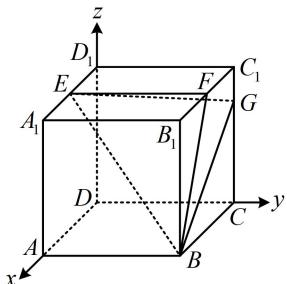

> [!faq]- 《第2节 空间向量的应用：证平行、垂直与求角》参考答案
>
> > [!success]- **【答案】** 详见解析
>
> > [!note]- **【分析】**
> > 本题未单列分析。
>
> > [!note]- **【解析】**
> > 解: (1) (正方体中容易建系, 考虑建系, 用向量法证 $GF \perp$
> >
> > 平面 EBF，只需证 $\overrightarrow{GF} \cdot \overrightarrow{EF} = 0$ 和 $\overrightarrow{GF} \cdot \overrightarrow{EB} = 0$
> >
> > 以 $D$ 为原点建立如图所示的空间直角坐标系，
> >
> > 则 $B(4,4,0)$ ， $E(2,0,4)$ ， $F(2,4,4)$ ， $G(0,4,3)$
> >
> > 所以 $\overrightarrow{GF} = (2,0,1)$ ， $\overrightarrow{EF} = (0,4,0)$ ， $\overrightarrow{EB} = (2,4,-4)$
> >
> > 从而 $\overrightarrow{GF} \cdot \overrightarrow{EF} = 2 \times 0 + 0 \times 4 + 1 \times 0 = 0$
> >
> > $\overrightarrow{GF} \cdot \overrightarrow{EB} = 2 \times 2 + 0 \times 4 + 1 \times (-4) = 0$ ，故 $\overrightarrow{GF} \perp \overrightarrow{EF}$ ，
> >
> > $\overrightarrow{GF} \perp \overrightarrow{EB}$ ，所以 $GF \perp EF$ ， $GF \perp EB$ ，结合 $EF$ ， $EB$ 是平面 $EBF$ 内的相交直线可得 $GF \perp$ 平面 $EBF$ .
> >
> > (2) (求面面夹角余弦, 需要两个面的法向量, $\overrightarrow{GF}$ 可以作为面 $EBF$ 的法向量, 故只需求面 $EBG$ 的法向量)
> >
> > 由（1）可得 $\overrightarrow{EG} = (-2,4, - 1)$ ， $\overrightarrow{GB} = (4,0, - 3)$
> >
> > 设平面 EBG 的法向量为 $\boldsymbol{m} = (x, y, z)$ ,
> >
> > 则 $\left\{ \begin{array}{l} \pmb{m} \cdot \overrightarrow{EG} = -2x + 4y - z = 0 \\ \pmb{m} \cdot \overrightarrow{GB} = 4x - 3z = 0 \end{array} \right.$ ，令 $x = 6$ ，则 $\left\{ \begin{array}{l} y = 5 \\ z = 8 \end{array} \right.$ ，
> >
> > 所以 $\pmb {m} = (6,5,8)$ 是平面EBG的一个法向量，
> >
> > 由（1）可得 $\overrightarrow{GF} = (2,0,1)$ 是平面 $EBF$ 的一个法向量，
> >
> > 设平面 $EBF$ 与平面 $EBG$ 的夹角为 $\theta$ ，则 $\cos \theta =$
> >
> > $$
> > \left| \cos <   \boldsymbol {m}, \overrightarrow {G F} > \right| = \frac {\left| \boldsymbol {m} \cdot \overrightarrow {G F} \right|}{\left| \boldsymbol {m} \right| \cdot \left| \overrightarrow {G F} \right|} = \frac {\left| 6 \times 2 + 5 \times 0 + 8 \times 1 \right|}{\sqrt {6 ^ {2} + 5 ^ {2} + 8 ^ {2}} \times \sqrt {2 ^ {2} + 1 ^ {2}}} = \frac {4}{5},
> > $$
> >
> > 所以平面 $EBF$ 与平面 $EBG$ 夹角的余弦值为 $\frac{4}{5}$ .
> >
> > (3) (怎样求 $V_{D - BEF}$ ? 不妨以 $BEF$ 为底面, 则高即为点 $D$ 到平面 $BEF$ 的距离, 可用向量法计算, 下面先求此距离)
> >
> > 由（1）可得 $\overrightarrow{DB} = (4,4,0)$ ， $\overrightarrow{GF} = (2,0,1)$ 是平面BEF的一个法向量，所以由点到平面的距离公式，点 $D$ 到平面BEF的距离 $d = \frac{\left|\overrightarrow{DB}\cdot\overrightarrow{GF}\right|}{\left|\overrightarrow{GF}\right|} = \frac{\left|4\times 2 + 4\times 0 + 0\times 1\right|}{\sqrt{2^2 + 1^2}} = \frac{8}{\sqrt{5}}$
> >
> > (再算 $S_{\triangle BEF}$ ，不难发现 $EF \perp BF$ ，下面先用向量法证明)
> >
> > 由（1）可得 $\overrightarrow{EF}=(0,4,0)$ ， $\overrightarrow{BF}=(-2,0,4)$ ，
> >
> > 所以 $EF = |\overrightarrow{EF}| = 4$ ， $BF = |\overrightarrow{BF}| = \sqrt{(-2)^2 + 4^2} = 2\sqrt{5}$
> >
> > 且 $\overrightarrow{EF} \cdot \overrightarrow{BF} = 0 \times (-2) + 4 \times 0 + 0 \times 4 = 0$
> >
> > 所以 $\overrightarrow{EF} \perp \overrightarrow{BF}$ ，从而 $EF \perp BF$ ，
> >
> > 故 $S_{\triangle BEF} = \frac{1}{2} EF\cdot BF = \frac{1}{2}\times 4\times 2\sqrt{5} = 4\sqrt{5}$
> >
> > 所以 $V_{D - BEF} = \frac{1}{3} S_{\triangle BEF}\cdot d = \frac{1}{3}\times 4\sqrt{5}\times \frac{8}{\sqrt{5}} = \frac{32}{3}.$
> >
> > 
> >
> > 注：由于空间向量计算比较无脑，所以以下题目选取均具有一定灵活性.
