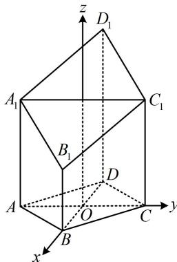

> [!faq]- 《第2节 空间向量的应用：证平行、垂直与求角》参考答案
>
> > [!success]- **【答案】** 详见解析
>
> > [!note]- **【分析】**
> > 本题未单列分析。
>
> > [!note]- **【解析】**
> > 解: (1) (要证线面垂直, 需证直线垂直于平面内的两条相
> >
> > 交直线，这里选面 $ACC_{1}A_{1}$ 内的哪两条相交直线呢？由题设条件不难发现 $AC$ 和 $AA_{1}$ 都与 $BD$ 垂直，所以就选它们）
> >
> > 因为四边形 ABCD 为菱形，所以 $AC \perp BD$ ，
> >
> > 又 $AA_{1}\perp$ 平面ABCD， $BD\subset$ 平面ABCD，所以 $AA_{1}\perp BD$ ，
> >
> > 因为 $AA_{1} \cap AC = A$ ， $AA_{1} \subset$ 平面 $ACC_{1}A_{1}$
> >
> > $AC \subset$ 平面 $ACC_{1}A_{1}$ ，所以 $BD \perp$ 平面 $ACC_{1}A_{1}$ .
> >
> > (2) (图形容易建系, 可考虑直接建系求目标二面角的正弦值) 设 $AC \cap BD = O$ , 以 $O$ 为原点建立如图所示的空间直角坐标系, 因为四边形 $ABCD$ 是菱形, $\angle BAD = 60^{\circ}$ ,
> >
> > 所以 $\triangle ABD$ 和 $\triangle BCD$ 都是正三角形，
> >
> > 又 $AB = 2$ ，所以 $OB = \frac{1}{2} BD = \frac{1}{2} AB = 1$ ， $OA = OC = \sqrt{3}$
> >
> > 故 $A_{1}\left(0, - \sqrt{3},\frac{7}{2}\right),B_{1}(1,0,2),C_{1}\left(0,\sqrt{3},\frac{7}{2}\right),$
> >
> > 所以 $\overrightarrow{A_1B_1} = \left(1,\sqrt{3}, - \frac{3}{2}\right),\quad \overrightarrow{B_1C_1} = \left(-1,\sqrt{3},\frac{3}{2}\right),$
> >
> > 设平面 $A_{1}B_{1}C_{1}D_{1}$ 的法向量为 $\pmb {m} = (x,y,z)$
> >
> > 则 $\left\{ \begin{array}{l} \pmb{m} \cdot \overrightarrow{A_1B_1} = x + \sqrt{3} y - \frac{3}{2} z = 0 \\ \pmb{m} \cdot \overrightarrow{B_1C_1} = -x + \sqrt{3} y + \frac{3}{2} z = 0 \end{array} \right.$ ，令 $z = 2$ 得 $\left\{ \begin{array}{l} x = 3 \\ y = 0 \end{array} \right.$ ，
> >
> > 所以 $\pmb{m} = (3,0,2)$ 是平面 $A_{1}B_{1}C_{1}D_{1}$ 的一个法向量，
> >
> > 由图可知 $\pmb {n} = (0,0,1)$ 是平面ABCD的一个法向量，
> >
> > 所以 $\cos < m, n > = \frac{m \cdot n}{|m| \cdot |n|} = \frac{3 \times 0 + 0 \times 0 + 2 \times 1}{\sqrt{3^2 + 2^2} \times 1} = \frac{2\sqrt{13}}{13}$
> >
> > 故所求二面角的正弦值为 $\sqrt{1 - \left(\frac{2\sqrt{13}}{13}\right)^2} = \frac{3\sqrt{13}}{13}$
> >
> > 
