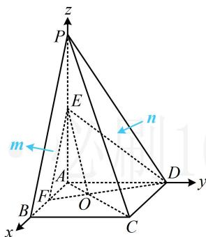
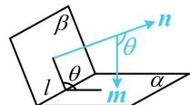

> [!faq]- 《第2节 空间向量的应用：证平行、垂直与求角》参考答案
>
> > [!success]- **【答案】** 详见解析
>
> > [!note]- **【分析】**
> > 本题未单列分析。
>
> > [!note]- **【解析】**
> > 解: (1) (几何法不好证, 但图形本身就有三条两两垂直的
> >
> > 直线，故很方便建系，只需证 $\overrightarrow{OE} \cdot \overrightarrow{CD} \neq 0$
> >
> > 以 $A$ 为原点建立如图所示的空间直角坐标系，则
> >
> > $E\left(0,0,\frac{3}{2}\right)$ ， $C(2,2,0)$ ， $D(0,2,0)$ ，所以 $\overrightarrow{CD}=(-2,0,0)$ ，
> >
> > （求 $\overrightarrow{OE}$ 需要点 $O$ 的坐标，故得找到 $O$ 在 $AC$ 上的位置，可借助相似分析相似比）
> >
> > 由图可知 $\triangle AOF\sim \triangle COD$ ，所以 $\frac{OA}{OC} = \frac{AF}{CD} = \frac{1}{2}$
> >
> > 从而 $OA = \frac{1}{2} OC$ ，故 $OA = \frac{1}{3} AC$
> >
> > 所以 $O\left(\frac{2}{3}, \frac{2}{3}, 0\right)$ ，从而 $\overrightarrow{OE} = \left(-\frac{2}{3}, -\frac{2}{3}, \frac{3}{2}\right)$ ，
> >
> > 故 $\overrightarrow{OE} \cdot \overrightarrow{CD} = \frac{4}{3} \neq 0$ ，所以 $OE$ 与 $CD$ 不垂直.
> >
> > （2）由图可知， $B(2,0,0)$ ， $P(0,0,3)$
> >
> > 所以 $\overrightarrow{BC} = (0,2,0)$ ， $\overrightarrow{CP} = (-2, - 2,3)$
> >
> > 设平面 BPC, PCD 的法向量分别为 $\boldsymbol{m} = (x_{1}, y_{1}, z_{1})$ ,
> >
> > $\boldsymbol{n}=(x_{2},y_{2},z_{2})$ ，则 $\left\{\begin{aligned}\boldsymbol{m}\cdot\overrightarrow{BC}&=2y_{1}=0\\\boldsymbol{m}\cdot\overrightarrow{CP}&=-2x_{1}-2y_{1}+3z_{1}=0\end{aligned}\right.$
> >
> > 所以 $\left\{ \begin{array}{l} y_{1} = 0 \\ -2x_{1} + 3z_{1} = 0 \end{array} \right.$ ，令 $x_{1} = 3$ ，则 $z_{1} = 2$ ，
> >
> > 故 $\pmb{m} = (3,0,2)$ 是平面BPC的一个法向量，
> >
> > (此处由图可以想象所求二面角为钝角, 若想不出来, 取法向量时, 就取成一个朝内, 一个朝外, 如图)
> >
> > 又 $\left\{ \begin{array}{l} \pmb{n} \cdot \overrightarrow{CP} = -2x_2 - 2y_2 + 3z_2 = 0 \\ \pmb{n} \cdot \overrightarrow{CD} = -2x_2 = 0 \end{array} \right.$ ，所以 $\left\{ \begin{array}{l} x_2 = 0 \\ -2y_2 + 3z_2 = 0 \end{array} \right.$ ，
> >
> > 令 $y_{2} = -3$ ，则 $x_{2} = 0$ ， $z_{2} = -2$
> >
> > 所以 $\boldsymbol{n}=(0,-3,-2)$ 是平面 PCD 的一个法向量，
> >
> > 从而 $\cos < m, n > = \frac{m \cdot n}{|m| \cdot |n|} = \frac{-4}{\sqrt{13} \times \sqrt{13}} = -\frac{4}{13}$ ,
> >
> > 由图可知，二面角 $B - PC - D$ 为钝角，故其余弦值为 $-\frac{4}{13}$
> >
> > 
>
> > [!tip]- **【反思】**
> > 若看图不易得出二面角的钝锐，可将法向量取成一个朝内，一个朝外，它们的夹角即为二面角，如图.
> >
> > 
