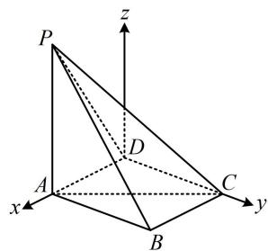

> [!faq]- 《第2节 空间向量的应用：证平行、垂直与求角》参考答案
>
> > [!success]- **【答案】** 详见解析
>
> > [!note]- **【分析】**
> > 本题未单列分析。
>
> > [!note]- **【解析】**
> > 解：（1）（证线面平行，先找线线平行，观察图形可猜测
> >
> > $AD \parallel BC$ ，故尝试找理由）因为 $PA \perp$ 平面ABCD，
> >
> > $AD \subset$ 平面 $ABCD$ ，所以 $AD \perp PA$
> >
> > 又 $AD \perp PB$ ，且 $PA, PB \subset$ 平面 $PAB, PA \cap PB = P$ ，
> >
> > 所以 $AD \perp$ 平面 $PAB$ ,
> >
> > 因为 $AB \subset$ 平面 $PAB$ ，所以 $AD \perp AB$ ①，
> >
> > 由题意， $BC = 1$ ， $AB = \sqrt{3}$ ， $AC = 2$
> >
> > 所以 $BC^{2} + AB^{2} = AC^{2}$ ，故 $BC\bot AB$ ②，
> >
> > 由①②以及 $AD$ ， $BC$ ， $AB$ 都是平面ABCD内的直线可得 $AD / / BC$ ，又因为 $AD\not\subset$ 平面PBC， $BC\subset$ 平面PBC，所以 $AD / /$ 平面PBC.
> >
> > (2) (有 $AD \perp DC$ , 则可以 $D$ 为原点建系, 方便写 $A, C$ 的坐标, 用向量法计算二面角 $A - CP - D$ )
> >
> > 以 $D$ 为原点建立如图所示的空间直角坐标系，
> >
> > 设 $AD = a(0 < a < 2)$ ，则 $CD = \sqrt{AC^2 - AD^2} = \sqrt{4 - a^2}$ ，
> >
> > 所以 $D(0,0,0)$ ， $P(a,0,2)$ ， $A(a,0,0)$ ， $C(0,\sqrt{4-a^{2}},0)$ ，
> >
> > 故 $\overrightarrow{DP} = (a,0,2)$ ， $\overrightarrow{CP} = (a, - \sqrt{4 - a^2},2)$ ， $\overrightarrow{AP} = (0,0,2)$
> >
> > 设平面 DCP 和平面 ACP 的法向量分别为 $\boldsymbol{m}=(x_{1},y_{1},z_{1})$ ,
> >
> > $\pmb{n}=(x_{2},y_{2},z_{2})$ ，则 $\left\{\begin{aligned}\pmb{m}\cdot\overrightarrow{DP}=ax_{1}+2z_{1}&=0\\\pmb{m}\cdot\overrightarrow{CP}=ax_{1}-\sqrt{4-a^{2}}y_{1}+2z_{1}&=0\end{aligned}\right.$
> >
> > 令 $x_{1} = 2$ ，则 $\left\{ \begin{array}{l}y_{1} = 0\\ z_{1} = -a \end{array} \right.$
> >
> > 所以 $\pmb {m} = (2,0, - a)$ 是平面 $DCP$ 的一个法向量，
> >
> > $$
> > \left\{ \begin{array}{l} \boldsymbol {n} \cdot \overrightarrow {C P} = a x _ {2} - \sqrt {4 - a ^ {2}} y _ {2} + 2 z _ {2} = 0 \\ \boldsymbol {n} \cdot \overrightarrow {A P} = 2 z _ {2} = 0 \end{array} , \right.
> > $$
> >
> > 令 $x_{2} = \sqrt{4 - a^{2}}$ ，则 $\left\{ \begin{array}{l}y_{2} = a\\ z_{2} = 0 \end{array} \right.$
> >
> > 所以 $n = (\sqrt{4 - a^2}, a, 0)$ 是平面 $ACP$ 的一个法向量，
> >
> > 设二面角 $A - CP - D$ 的大小为 $\theta$ ，则 $\left|\cos \theta \right| = \left|\cos < m, n >\right|$
> >
> > $$
> > = \frac {| \boldsymbol {m} \cdot \boldsymbol {n} |}{| \boldsymbol {m} | \cdot | \boldsymbol {n} |} = \frac {2 \sqrt {4 - a ^ {2}}}{\sqrt {4 + a ^ {2}} \cdot \sqrt {4 - a ^ {2} + a ^ {2}}} = \frac {\sqrt {4 - a ^ {2}}}{\sqrt {4 + a ^ {2}}}
> > $$
> >
> > 由题意， $\sin \theta = \frac{\sqrt{42}}{7}$ ，所以 $\left|\cos \theta \right| = \sqrt{1 - \sin^2\theta} = \frac{1}{\sqrt{7}}$
> >
> > 故 $\frac{\sqrt{4 - a^2}}{\sqrt{4 + a^2}} = \frac{1}{\sqrt{7}}$ ，解得： $a = \sqrt{3}$ ，所以 $AD = \sqrt{3}$
> >
> > 
>
> > [!tip]- **【反思】**
> > 本题坐标看着吓人，但只要合理的设点与计算，计算量还是在正常范围内；本题也可以用几何法解，注意到 $PA \perp$ 平面ABCD，所以过点 $D$ 容易作出平面PAC的垂线，故也可考虑用三垂线法作出二面角 $A - CP - D$ 的平面角来分析，感兴趣可以试试.
