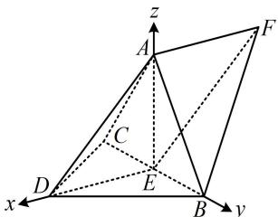

> [!faq]- 《第2节 空间向量的应用：证平行、垂直与求角》参考答案
>
> > [!success]- **【答案】** 详见解析
>
> > [!note]- **【分析】**
> > 本题未单列分析。
>
> > [!note]- **【解析】**
> > 解: (1) (BC 和 DA 是异面直线, 证异面直线垂直, 常找线面垂直, 可用逆推法. 假设 $BC \perp DA$ , 注意到条件中还有 $DB = DC$ , 所以 $BC \perp DE$ , 二者结合可得到 $BC \perp$ 面 $ADE$ , 故可通过证此线面垂直来证 $BC \perp DA$ )
> >
> > 因为 $DA = DB = DC$ ， $\angle ADB = \angle ADC = 60^{\circ}$
> >
> > 所以 $\triangle ADB$ 和 $\triangle ADC$ 是全等的正三角形，故 $AB = AC$
> >
> > 又 $E$ 为 $BC$ 中点，所以 $BC \perp AE$ ， $BC \perp DE$ ，
> >
> > 因为 $AE$ ， $DE\subset$ 平面 $ADE$ ， $AE\cap DE = E$
> >
> > 所以 $BC \perp$ 平面 $ADE$ ，又 $DA \subset$ 平面 $ADE$ ，所以 $BC \perp DA$ .
> >
> > (2) (由图可猜想 $EA, EB, ED$ 两两垂直, 若能证出这一结果, 就能建系处理, 故先尝试证明)
> >
> > 不妨设 $DA = DB = DC = 2$ ，则 $AB = AC = 2$
> >
> > 因为 $BD \perp CD$ ，所以 $BC = \sqrt{DB^2 + DC^2} = 2\sqrt{2}$
> >
> > 故 $DE = CE = BE = \frac{1}{2} BC = \sqrt{2}$ ， $AE = \sqrt{AC^2 - CE^2} = \sqrt{2}$
> >
> > 所以 $AE^2 + DE^2 = 4 = AD^2$ ，故 $AE \perp DE$
> >
> > 所以 $EA, EB, ED$ 两两垂直，
> >
> > 以 $E$ 为原点建立如图所示的空间直角坐标系，
> >
> > 则 $A(0,0,\sqrt{2})$ ， $D(\sqrt{2},0,0)$ ， $B(0,\sqrt{2},0)$ ，
> >
> > 所以 $\overrightarrow{DA} = (-\sqrt{2},0,\sqrt{2})$ ， $\overrightarrow{AB} = (0,\sqrt{2}, - \sqrt{2})$ ，由 $\overrightarrow{EF} = \overrightarrow{DA}$ 可
> >
> > 知四边形 ADEF 是平行四边形，所以 $\overrightarrow{FA} = \overrightarrow{ED} = (\sqrt{2}, 0, 0)$ ，
> >
> > 设平面 $DAB$ 和平面 $ABF$ 的法向量分别为 $\pmb {m} = (x_1,y_1,z_1)$
> >
> > $\boldsymbol{n}=(x_{2},y_{2},z_{2})$ ，则 $\left\{\begin{aligned}\boldsymbol{m}\cdot\overrightarrow{DA}&=-\sqrt{2}x_{1}+\sqrt{2}z_{1}=0\\\boldsymbol{m}\cdot\overrightarrow{AB}&=\sqrt{2}y_{1}-\sqrt{2}z_{1}=0\end{aligned}\right.$ ，令 $x_{1}=1$ ，
> >
> > 则 $\left\{ \begin{array}{l} y_{1} = 1 \\ z_{1} = 1 \end{array} \right.$ ，所以 $\pmb{m} = (1,1,1)$ 是平面 $DAB$ 的一个法向量，
> >
> > $\left\{ \begin{array}{l} \boldsymbol{n} \cdot \overrightarrow{AB} = \sqrt{2} y_{2} - \sqrt{2} z_{2} = 0 \\ \boldsymbol{n} \cdot \overrightarrow{FA} = \sqrt{2} x_{2} = 0 \end{array} \right.$ ，令 $y_{2} = 1$ ，则 $\left\{ \begin{array}{l} x_{2} = 0 \\ z_{2} = 1 \end{array} \right.$ ，
> >
> > 所以 $\pmb {n} = (0,1,1)$ 是平面 $ABF$ 的一个法向量，
> >
> > 从而 $|\cos < m, n >| = \frac{|m \cdot n|}{|m| \cdot |n|} = \frac{2}{\sqrt{3} \times \sqrt{2}} = \frac{\sqrt{6}}{3}$ ,
> >
> > 故二面角 $D - AB - F$ 的正弦值为 $\sqrt{1 - \left(\frac{\sqrt{6}}{3}\right)^2} = \frac{\sqrt{3}}{3}$ .
> >
> > 
