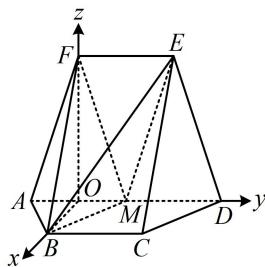

> [!faq]- 《第2节 空间向量的应用：证平行、垂直与求角》参考答案
>
> > [!success]- **【答案】** 详见解析
>
> > [!note]- **【分析】**
> > 本题未单列分析。
>
> > [!note]- **【解析】**
> > 解: (1) (证线面平行, 先找线线平行. 观察发现四边形
> >
> > BCDM像□，若是，则 $BM \parallel CD$ ，故尝试找理由）由题意， $BC \parallel AD$ ，且 $BC = \frac{1}{2} AD$ 又因为 $M$ 为 $AD$ 中点，所以 $BC \parallel MD$ ，且 $BC = MD$ ，从而四边形BCDM是平行四边形，故 $BM \parallel CD$ 因为 $BM \not\subset$ 平面CDE， $CD \subset$ 平面CDE，所以 $BM \parallel$ 平面CDE.
> >
> > (2)（求二面角考虑建系，怎样建？观察图形可发现 $\triangle FAM$ 和 $\triangle BAM$ 是有公共底边的等腰三角形，这种双等腰三角形模型中，常取公共底边中点，作辅助线）
> >
> > 如图，取 $AM$ 中点 $O$ ，连接 $FO$ ， $BO$ ，由（1）可得 $BM = CD$ ，又 $CD = AB = 2$ ， $AM = \frac{1}{2} AD = 2$ ，所以 $AB = BM = AM = 2$ ，结合 $O$ 为 $AM$ 中点得 $OB \perp AM$ ，由题意可得 $EF // DM$ ，且 $EF = DM$ ，所以四边形 $EFMD$ 为平行四边形，故 $FM = ED$ ，又因为四边形 $ADEF$ 为等腰梯形，所以 $ED = AF$ 故 $FM = AF$ ，结合 $O$ 为 $AM$ 中点可得 $FO \perp AM$
> >
> > （此时观察图形可猜测 $FO \perp OB$ ，若猜想成立，则可以 $O$ 为原点建系处理，故尝试找理由。由于题设条件有大量长度，故考虑通过验证 $\triangle FOB$ 满足勾股定理来证明 $FO \perp OB$ ）
> >
> > 由题意， $AF = ED = \sqrt{10}$ ，OA = 1，
> >
> > 所以 $FO = \sqrt{AF^2 - OA^2} = 3$ ，前面已证 $\triangle ABM$ 是边长为2的正三角形，所以 $OB = \sqrt{3}$
> >
> > 又 $FB = 2\sqrt{3}$ ，所以 $FO^{2} + OB^{2} = 12 = FB^{2}$ ，故 $FO \perp OB$ ，
> >
> > 以 $O$ 为原点建立如图所示的空间直角坐标系，
> >
> > 则 $M(0,1,0)$ ， $F(0,0,3)$ ， $B(\sqrt{3},0,0)$ ， $E(0,2,3)$
> >
> > 所以 $\overrightarrow{FB} = (\sqrt{3},0, - 3)$ ， $\overrightarrow{MB} = (\sqrt{3}, - 1,0)$ ， $\overrightarrow{ME} = (0,1,3)$
> >
> > 设平面 FBM 和平面 BME 的法向量分别为 $\boldsymbol{m}=(x_{1},y_{1},z_{1})$ ,
> >
> > $\pmb{n} = (x_{2},y_{2},z_{2})$ ，则 $\left\{ \begin{array}{l}\pmb {m}\cdot \overrightarrow{FB} = \sqrt{3} x_1 - 3z_1 = 0\\ \pmb {m}\cdot \overrightarrow{MB} = \sqrt{3} x_1 - y_1 = 0 \end{array} \right.$ ，令 $x_{1} = \sqrt{3}$
> >
> > 则 $\left\{ \begin{array}{l} y_{1} = 3 \\ z_{1} = 1 \end{array} \right.$ ，所以 $\pmb {m} = (\sqrt{3},3,1)$ 是平面 $FBM$ 的一个法向量，
> >
> > 又 $\left\{ \begin{array}{l} \pmb{n} \cdot \overrightarrow{MB} = \sqrt{3} x_2 - y_2 = 0 \\ \pmb{n} \cdot \overrightarrow{ME} = y_2 + 3z_2 = 0 \end{array} \right.$ ，令 $y_2 = 3$ ，则 $\left\{ \begin{array}{l} x_2 = \sqrt{3} \\ z_2 = -1 \end{array} \right.$ ，
> >
> > 所以 $\boldsymbol{n}=(\sqrt{3},3,-1)$ 是平面 BME 的一个法向量，
> >
> > 设二面角 $F - BM - E$ 的大小为 $\theta$ ，则 $\left|\cos \theta \right| = \left|\cos <  m, n >\right|$
> >
> > $= \frac{|m\cdot n|}{|m|\cdot|n|} = \frac{11}{13}$ 所以 $\sin \theta = \sqrt{1 - \cos^2\theta} = \frac{4\sqrt{3}}{13}$
> >
> > 故二面角 $F - BM - E$ 的正弦值为 $\frac{4\sqrt{3}}{13}$
> >
> > 
