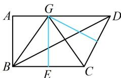
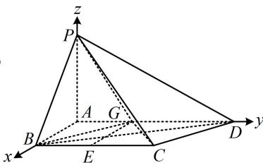

> [!faq]- 《第2节 空间向量的应用：证平行、垂直与求角》参考答案
>
> > [!success]- **【答案】** 详见解析
>
> > [!note]- **【分析】**
> > 本题未单列分析。
>
> > [!note]- **【解析】**
> > 解：（1）（证面面垂直，先找线面垂直，由题设条件不难）
> >
> > 发现 $PA, AB, AD$ 两两垂直, 故 $AB \perp$ 面 $PAD, AD \perp$ 面 $PAB$ , 任选其一来证明, 都能证得此小问的结论)
> >
> > 由 $PA \perp$ 平面 $ABCD, AB \subset$ 平面 $ABCD$ 可得 $AB \perp PA$ ,
> >
> > 又 $AB \perp AD$ ，且 $PA, AD \subset$ 平面 $PAD, PA \cap AD = A$
> >
> > 所以 $AB \perp$ 平面 $PAD$ ,
> >
> > 结合 $AB \subset$ 平面 $PAB$ 可得平面 $PAB \perp$ 平面 $PAD$ .
> >
> > （2）（i）解法1：（怎么找球心的位置？可以逆向思考，根据要证的结论，我们知道球心在平面ABCD上，且到B，C，D等距，则球心必为 $\triangle BCD$ 的外心，怎么找该外心？不妨把梯形ABCD单独画出来看看，如图1，BC与CD的中垂线交点 $G$ 就是 $\triangle BCD$ 的外心，由图可猜想点 $G$ 在AD上，故尝试证明）
> >
> > 如图1，取 $BC$ 中点 $E$ ，过 $E$ 作 $BC$ 的垂线交 $AD$ 于点 $G$ ，连接 $GB$ ， $GC$ ，则 $AGEB$ 是矩形，
> >
> > 所以 $GA = BE = \frac{1}{2} BC = 1$ ， $GD = AD - GA = \sqrt{3}$ ，
> >
> > $GE = AB = \sqrt{2}$ ， $GC = GB = \sqrt{AB^2 + GA^2} = \sqrt{3}$
> >
> > （我们发现 $G$ 到 $B, C, D$ 的距离相等，所以 $G$ 就是 $\triangle BCD$ 的外心，如何证明它也是球心？只需证 $GP$ 也等于 $\sqrt{3}$ ，观察图2发现 $GP$ 容易在 $\triangle PGA$ 中求得）
> >
> > 如图2，连接 $GP$ ，由 $PA \perp$ 平面ABCD， $GP \subset$ 平面ABCD得 $PA \perp GA$ ，所以 $GP = \sqrt{PA^2 + GA^2} = \sqrt{3}$
> >
> > 所以 $GP = GB = GC = GD = \sqrt{3}$ ，故 $P, B, C, D$ 都在以 $G$ 为球心， $\sqrt{3}$ 为半径的球面上，
> >
> > 由题意，点 O 与 G 重合，所以 O 在平面 ABCD 上.
> >
> >   
> > 图1
> >
> >   
> > 图2
> >
> > 解法2：（经分析，三棱锥 $P - BCD$ 不特殊，没有对应的外接球模型可套，怎么找球心 $O$ ？注意到图中天然有三条两两垂直的直线，故不妨考虑建系处理，可直接设 $O$ 的坐标，抓住 $OP = OB = OC = OD$ 来建立方程组求解所设坐标）
> >
> > 以 $A$ 为原点建立如图2所示的空间直角坐标系，则由题意， $P(0,0,\sqrt{2})$ ， $B(\sqrt{2},0,0)$ ， $C(\sqrt{2},2,0)$ ， $D(0,\sqrt{3} +1,0)$ ，
> >
> > 设 $O(x,y,z)$ ，因为 $P$ ， $B$ ， $C$ ， $D$ 在球 $O$ 的球面上，所以 $OP = OB = OC = OD$ ，从而 $OP^2 = OB^2 = OC^2 = OD^2$
> >
> > $$
> > x ^ {2} + y ^ {2} + (z - \sqrt {2}) ^ {2} = (x - \sqrt {2}) ^ {2} + y ^ {2} + z ^ {2} = (x - \sqrt {2}) ^ {2} + (y - 2) ^ {2} + z ^ {2} = x ^ {2} + (y - \sqrt {3} - 1) ^ {2} + z ^ {2} \quad ①,
> > $$
> >
> > (上述连等式比较复杂, 如何求解? 应尝试寻找结构类似的两部分, 从该处入手, 以便于抵消掉一些项, 达到化简的目的, 观察发现 $(x - \sqrt{2})^{2} + y^{2} + z^{2} = (x - \sqrt{2})^{2} + (y - 2)^{2} + z^{2}$ 化简后未知数只有 $y$ , 从而能求出 $y$ , 故由此切入)
> >
> > 由①中的 $(x - \sqrt{2})^2 + y^2 + z^2 = (x - \sqrt{2})^2 + (y - 2)^2 + z^2$ 可知 $y^2 = (y - 2)^2$ ，解得： $y = 1$
> >
> > 代回式①化简得： $x^{2} + (z - \sqrt{2})^{2} + 1 = (x - \sqrt{2})^{2} + z^{2} + 1 = x^{2} + z^{2} + 3$
> >
> > 由其中 $(x - \sqrt{2})^2 + z^2 + 1 = x^2 + z^2 + 3$ 这部分可求得 $x = 0$ ，代入 $x^2 + (z - \sqrt{2})^2 + 1 = (x - \sqrt{2})^2 + z^2 + 1$ 可求得 $z = 0$ ，所以球心 $O$ 的坐标为 $(0,1,0)$ ，该点在平面 $ABCD$ 内.
> >
> > （ii）由（i）可得 $\overrightarrow{AC} = (\sqrt{2}, 2, 0)$ ， $\overrightarrow{PO} = (0, 1, -\sqrt{2})$ ，所以 $\left|\cos < \overrightarrow{AC}, \overrightarrow{PO} >\right| = \frac{\left|\overrightarrow{AC} \cdot \overrightarrow{PO}\right|}{\left|\overrightarrow{AC}\right| \cdot \left|\overrightarrow{PO}\right|} = \frac{\left|\sqrt{2} \times 0 + 2 \times 1 + 0 \times (-\sqrt{2})\right|}{\sqrt{(\sqrt{2})^2 + 2^2} \times \sqrt{1^2 + (-\sqrt{2})^2}} = \frac{\sqrt{2}}{3}$ ，故直线 $AC$ 与 $PO$ 所成角的余弦值为 $\frac{\sqrt{2}}{3}$ .
