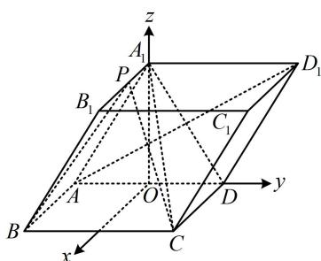

> [!faq]- 《第2节 空间向量的应用：证平行、垂直与求角》参考答案
>
> > [!success]- **【答案】** 详见解析
>
> > [!note]- **【分析】**
> > 本题未单列分析。
>
> > [!note]- **【解析】**
> > 解: (1) (证线线垂直, 应找线面垂直. 结合题干的面面垂
> >
> > 直，我们发现 $A_{1}C$ 在面 $ADD_{1}A_{1}$ 内的射影是 $A_{1}D$ ，故由三垂线定理可知要找的面是 $A_{1}CD$ ，即先证 $AD_{1} \perp$ 面 $A_{1}CD$ ）
> >
> > 如图，连接 $A_{1}D$ ，因为ABCD为正方形，所以 $CD\bot AD$
> >
> > 又平面 $ADD_{1}A_{1}\perp$ 平面ABCD，
> >
> > 平面 $ADD_{1}A_{1}\cap$ 平面 $ABCD = AD$ ， $CD\subset$ 平面 $ABCD$
> >
> > 所以 $CD \perp$ 平面 $ADD_{1}A_{1}$
> >
> > 因为 $AD_{1} \subset$ 平面 $ADD_{1}A_{1}$ ，所以 $AD_{1} \perp CD$ ①，
> >
> > 又 $ADD_{1}A_{1}$ 为菱形，所以 $AD_{1} \perp A_{1}D$ ，结合①以及 $A_{1}D$
> >
> > $CD\subset$ 平面 $A_{1}CD$ ， $A_{1}D\cap CD = D$ 可得 $AD_{1}\bot$ 平面 $A_{1}CD$
> >
> > 因为 $A_{1}C \subset$ 平面 $A_{1}CD$ ，所以 $AD_{1} \perp A_{1}C$
> >
> > (2) (z轴位置选哪? 看见题目有面面垂直, 故过 $A_{1}$ 作交线 $AD$ 的垂线, z轴就有了)
> >
> > 取 $AD$ 中点 $O$ ，连接 $A_{1}O$ ，因为 $ADD_{1}A_{1}$ 为菱形，
> >
> > 所以 $AA_{1} = AD$ ，又 $\angle A_{1}AD = \frac{\pi}{3}$ ，所以 $\triangle AA_{1}D$ 为正三角形，
> >
> > 故 $A_{1}O \perp AD$ ，结合平面 $ADD_{1}A_{1} \perp$ 平面ABCD可得 $A_{1}O \perp$
> >
> > 平面ABCD，
> >
> > 以 $O$ 为原点建立如图所示的空间直角坐标系，
> >
> > 由 $AB = 2$ 可得 $AD = 2$ ， $A_{1}O = \sqrt{3}$
> >
> > 所以 $A_{1}(0,0,\sqrt{3})$ ， $B_{1}(2,0,\sqrt{3})$ ， $B(2,-1,0)$ ， $C(2,1,0)$ ，
> >
> > $$
> > A (0, - 1, 0), \quad D _ {1} (0, 2, \sqrt {3})
> > $$
> >
> > (P 是动点, 观察发现直线 $A_{1}B_{1}$ 在面 $ABCD$ 上的射影就是 $x$ 轴, 所以 $P$ 的坐标只有 $x$ 分量会变)
> >
> > 点 $P$ 在 $A_{1}B_{1}$ 上运动，可设 $P(m,0,\sqrt{3})(0\leq m\leq 2)$
> >
> > 所以 $\overrightarrow{AD_1} = (0,3,\sqrt{3})$ ， $\overrightarrow{BC} = (0,2,0)$ ， $\overrightarrow{BP} = (m - 2,1,\sqrt{3})$
> >
> > 设平面 $PBC$ 的法向量为 $\pmb {n} = (x,y,z)$
> >
> > 则 $\left\{ \begin{array}{l} \pmb{n} \cdot \overrightarrow{BC} = 2y = 0 \\ \pmb{n} \cdot \overrightarrow{BP} = (m - 2)x + y + \sqrt{3}z = 0 \end{array} \right.$
> >
> > 令 $x = \sqrt{3}$ ，则 $y = 0$ ， $z = 2 - m$
> >
> > 所以 $\boldsymbol{n}=(\sqrt{3},0,2-m)$ 是平面 PBC 的一个法向量，
> >
> > 由题意， $\sin \theta = |\cos <  \overrightarrow{AD_1},\pmb {n} > | = \frac{| \overrightarrow{AD_1}\cdot\pmb{n}|}{|\overrightarrow{AD_1}| \cdot|\pmb{n}|}$
> >
> > $= \frac{\sqrt{3}(2 - m)}{2\sqrt{3} \times \sqrt{3 + (2 - m)^2}} = \frac{1}{4}$ ，解得： $m = 1$ ，所以 $A_1P = 1$ .
> >
> > 
>
> > [!tip]- **【反思】**
> > 当 $P$ 是线上动点时，若能看出其坐标规律，则可直接设坐标.如本题点 $P$ 的 $y$ 坐标为0， $z$ 坐标为 $\sqrt{3}$ ，只有 $x$ 坐标未定，则可直接设 $P(m,0,\sqrt{3})$ . 若没看出此规律，也可设 $\overrightarrow{A_1P} = \lambda \overrightarrow{A_1B}$ ，并由此将点 $P$ 的坐标用 $\lambda$ 表示.
