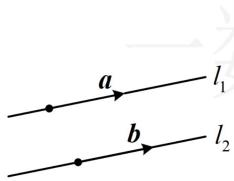
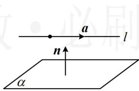
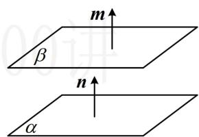
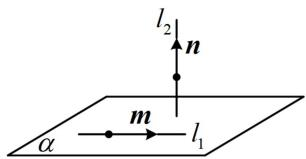
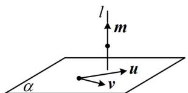
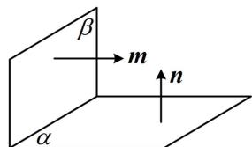
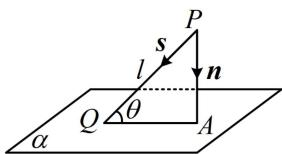
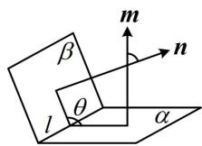
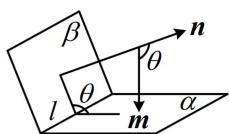

<!-- source-part:1 pages:1-10 -->

## 第2节 空间向量的应用：证平行、垂直与求角（★★★）

## 内容提要

用空间向量求解立体几何问题的步骤比较流程化，常分四步：

①建立空间直角坐标系，写出点的坐标；

②计算直线的方向向量、平面的法向量；

③根据问题，选择合适的公式计算；

④把向量运算的结果翻译成几何问题的答案.

下面归纳一些常见立体几何问题的向量求解方法:

1. 证线线平行：如图1，设 $l_{1}$ ， $l_{2}$ 是空间中不重合的两条直线，它们的方向向量分别为 $\pmb{a}$ 和 $\pmb{b}$ ，则 $l_{1} // l_{2}$ 的充要条件是 $\pmb{a} // \pmb{b}$ .

2. 证线面平行: 如图 2, 直线 $l$ 不在平面 $\alpha$ 内, 直线 $l$ 的方向向量为 $a$ , 平面 $\alpha$ 的法向量为 $n$ , 则 $l \parallel \alpha$ 的充要条件是 $a \cdot n = 0$ .

3. 证面面平行：如图3， $\alpha$ ， $\beta$ 是两个不重合的平面，它们的法向量分别为 $n$ ， $m$ ，则 $\alpha // \beta$ 的充要条件是 $n // m$ .

  
图1

  
图2

  
图3

4. 证线线垂直: 如图 4, 设直线 $l_{1}, l_{2}$ 的方向向量分别为 $\pmb{m}, \pmb{n}$ , 则 $l_{1} \perp l_{2} \Leftrightarrow \pmb{m} \perp \pmb{n} \Leftrightarrow \pmb{m} \cdot \pmb{n} = 0$ .

5. 证线面垂直：如图5，设 $m$ 为直线 $l$ 的方向向量， $u, v$ 为平面 $\alpha$ 内两个不共线的向量，则 $l \perp \alpha \Leftrightarrow m \cdot u = 0$ 且 $m \cdot v = 0$ .

6. 证面面垂直：如图6，设 $n, m$ 分别为平面 $\alpha, \beta$ 的法向量，则 $\alpha \perp \beta \Leftrightarrow m \perp n \Leftrightarrow m \cdot n = 0$

  
图4

  
图5

  
图6

7. 求线线角：设空间直线 $l_{1}$ ， $l_{2}$ 的夹角为 $\theta$ ，方向向量分别为 $\pmb{u}$ ， $\pmb{v}$ ，则 $\cos \theta = \frac{|\pmb{u} \cdot \pmb{v}|}{|\pmb{u}| \cdot |\pmb{v}|}$ .

8. 求线面角：如图7，设直线 $l$ 的方向向量为 $\pmb{s}$ ，平面 $\alpha$ 的法向量为 $\pmb{n}$ ， $l$ 与 $\alpha$ 所成角为 $\theta$ ，则 $\sin \theta = |\cos < s, n| = \frac{|s \cdot n|}{|s| \cdot |n|}$ .

9. 求二面角: 如图 8, 设平面 $\alpha$ , $\beta$ 的法向量分别为 $m$ , $n$ , 则二面角 $\alpha - l - \beta$ 的余弦值 $\cos \theta = \pm \cos < m, n > = \pm \frac{m \cdot n}{|m| \cdot |n|}$ , 若是求 $\sin \theta$ , 可由 $\sin \theta = \sqrt{1 - \cos^2 \theta}$ 来算, $\cos \theta$ 取正取负不影响结果; 若是求 $\cos \theta$ , 最终结果取正还是取负, 则需考虑二面角的钝锐, 一般可通过观察图形, 直观想象来判断; 若图形不易判断, 则求法向量时, 让一个朝内, 一个朝外, 它们的夹角即为二面角, 如图 9.

  
图7

  
图8

  
图9

![[高中/总复习/教辅/一数常规版2026/第9章 立体几何、空间向量/模块3 空间向量及其应用/第2节 空间向量的应用：证平行、垂直与求角/类型01_用空间向量证平行_垂直/类型01_用空间向量证平行_垂直.md]]
![[高中/总复习/教辅/一数常规版2026/第9章 立体几何、空间向量/模块3 空间向量及其应用/第2节 空间向量的应用：证平行、垂直与求角/类型02_用空间向量求线面角/类型02_用空间向量求线面角.md]]
![[高中/总复习/教辅/一数常规版2026/第9章 立体几何、空间向量/模块3 空间向量及其应用/第2节 空间向量的应用：证平行、垂直与求角/类型03_用空间向量求二面角/类型03_用空间向量求二面角.md]]
![[高中/总复习/教辅/一数常规版2026/第9章 立体几何、空间向量/模块3 空间向量及其应用/第2节 空间向量的应用：证平行、垂直与求角/强化训练/强化训练.md]]
