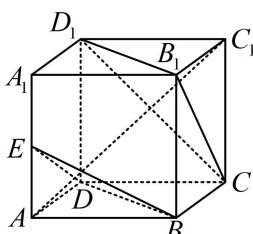

<!-- question-source:start -->
【例 1】（多选）如图，正方体 $ABCD-A_{1}B_{1}C_{1}D_{1}$ 中，E 为 $AA_{1}$ 的中点，则以下四个结论中，正确的有（）

A. $DB \parallel$ 平面 $CB_{1}D_{1}$ B. 平面 $BDE \parallel$ 平面 $CB_{1}D_{1}$ C. $AC_{1} \perp$ 平面 $CB_{1}D_{1}$ D. 平面 $CB_{1}D_{1} \perp$ 平面 $A_{1}BC_{1}$

<!-- question-source:end -->

![[高中/总复习/教辅/一数常规版2026/第9章 立体几何、空间向量/模块3 空间向量及其应用/第2节 空间向量的应用：证平行、垂直与求角/类型01_用空间向量证平行_垂直/例题/answers/Q00050608A1.md]]
