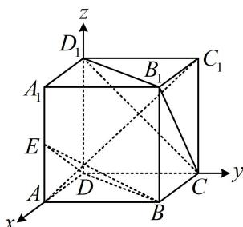

> [!faq]- 《第2节 空间向量的应用：证平行、垂直与求角》例题解析
>
> > [!success]- **【答案】** AC
>
> > [!note]- **【分析】**
> > 本题未单列分析。
>
> > [!note]- **【解析】**
> > 解析：A项，判断线面是否平行，就看直线的方向向量与平面的法向量是否垂直，
> >
> > 如图建系，设正方体的棱长为2，则 $D(0,0,0)$ ， $B(2,2,0)$ ， $C(0,2,0)$ ， $B_{1}(2,2,2)$ ， $D_{1}(0,0,2)$ 所以 $\overrightarrow{DB} = (2,2,0)$ ， $\overrightarrow{CB_1} = (2,0,2)$ ， $\overrightarrow{CD_1} = (0, - 2,2)$ ，设平面 $CB_{1}D_{1}$ 的法向量为 $\pmb {n} = (x,y,z)$ 则 $\left\{ \begin{array}{l}\pmb {n}\cdot \overrightarrow{CB_1} = 2x + 2z = 0\\ \pmb {n}\cdot \overrightarrow{CD_1} = -2y + 2z = 0 \end{array} \right.$ ，令 $x = 1$ 可得 $\left\{ \begin{array}{l}y = -1\\ z = -1 \end{array} \right.$ ，所以平面 $CB_{1}D_{1}$ 的一个法向量为 $\pmb {n} = (1, - 1, - 1)$ 因为 $\overrightarrow{DB}\cdot \pmb {n} = 2\times 1 + 2\times (-1) + 0\times (-1) = 0$ ，所以 $\overrightarrow{DB}\bot \pmb{n}$ ，从而 $DB / /$ 平面 $CB_{1}D_{1}$ ，故A项正确；
> >
> > $$
> > E (2, 0, 1)
> > $$
> >
> > $$
> > \overrightarrow {D E} = (2, 0, 1)
> > $$
> >
> > $$
> > \left\{ \begin{array}{l} \boldsymbol {m} \cdot \overrightarrow {D B} = 2 x ^ {\prime} + 2 y ^ {\prime} = 0 \\ \boldsymbol {m} \cdot \overrightarrow {D E} = 2 x ^ {\prime} + z ^ {\prime} = 0 \end{array} \right.
> > $$
> >
> > $$
> > x ^ {\prime} = 1
> > $$
> >
> > $$
> > \left\{ \begin{array}{l} y ^ {\prime} = - 1 \\ z ^ {\prime} = - 2 \end{array} \right.
> > $$
> >
> > $$
> > \boldsymbol {m} = \left(x ^ {\prime}, y ^ {\prime}, z ^ {\prime}\right)
> > $$
> >
> > $$
> > \boldsymbol {m} = (1, - 1, - 2)
> > $$
> >
> > $$
> > C B _ {1} D _ {1}
> > $$
> >
> > $$
> > \overrightarrow {A C _ {1}} = (- 2, 2, 2) = - 2 \boldsymbol {n}
> > $$
> >
> > $$
> > \overrightarrow {A C _ {1}} / / \boldsymbol {n}
> > $$
> >
> > $$
> > A C _ {1} \perp
> > $$
> >
> > $$
> > C B _ {1} D _ {1}
> > $$
> >
> > 由图可知， $A_{1}(2,0,2)$ ， $B(2,2,0)$ ， $C_1(0,2,2)$ ，所以 $\overrightarrow{A_1B} = (0,2, - 2)$ ， $\overrightarrow{A_1C_1} = (-2,2,0)$
> >
> > 设平面 $A_{1}BC_{1}$ 的法向量为 $\pmb {p} = (x^{\prime \prime},y^{\prime \prime},z^{\prime \prime})$ ，则 $\left\{ \begin{array}{l}\pmb {p}\cdot \overrightarrow{A_1B} = 2y'' - 2z'' = 0\\ \pmb {p}\cdot \overrightarrow{A_1C_1} = -2x'' + 2y'' = 0 \end{array} \right.$ 令 $x'' = 1$ ，则 $\left\{ \begin{array}{l}y'' = 1\\ z'' = 1 \end{array} \right.$ ，所以 $\pmb {p} = (1,1,1)$ 是平面 $A_{1}BC_{1}$ 的一个法向量，因为 $\pmb {p}\cdot \pmb {n} = 1\times 1 + 1\times (-1) + 1\times (-1) = -1\neq 0$ 所以平面 $A_{1}BC_{1}$ 与平面 $CB_{1}D_{1}$ 不垂直，故D项错误.
> >
> > 
>
> > [!tip]- **【反思】**
> > 当图形方便建系时, 我们常建立空间直角坐标系, 将几何问题转化为向量问题来求解; 建系证平行、垂直一般作为想不到几何法时的备选方案, 故只举 1 道例题, 帮大家熟悉有关问题的向量方法.
