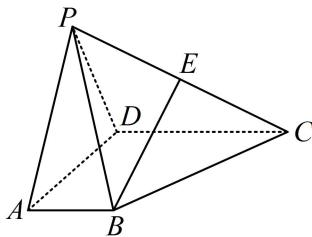
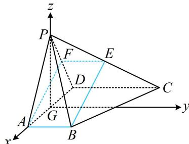

<!-- question-source:start -->
【例 2】如图，在四棱锥 P-ABCD 中，底面 ABCD 是梯形， $AB \parallel CD$ ， $AD \perp CD$ ，CD = 2AB = 4，

$\triangle PAD$ 是正三角形， $E$ 是棱 $PC$ 的中点.

(1) 证明: $BE \parallel$ 平面 $PAD$ ;

（2）若 $AD = 2\sqrt{3}$ ，平面 $PAD \perp$ 平面ABCD，求直线 $AB$ 与平面PBC所成角的正弦值.

（1）（先在面 $PAD$ 内过 $A$ 作 $BE$ 的平行线，作出来就发现构成的图形像平行四边形）

如图，取 $PD$ 中点 $F$ ，连接 $AF$ ， $EF$ ，因为 $E$ 为 $PC$ 的中点，所以 $EF \parallel CD$ 且 $EF = \frac{1}{2} CD$

又由题意， $AB \parallel CD$ 且 $CD = 2AB$ ，所以 $AB = \frac{1}{2}CD$ ，故 $EF \parallel AB$ 且 $EF = AB$ ，

所以 $ABEF$ 是平行四边形，故 $BE \parallel AF$ ，因为 $BE \not\subset$ 平面 $PAD$ ， $AF \subset$ 平面 $PAD$ ，所以 $BE \parallel$ 平面 $PAD$ .

(2) (条件中有面面垂直, 可通过作交线的垂线找到线面垂直, 再建系处理)

如图，取 $AD$ 中点 $G$ ，连接 $PG$ ，因为 $\triangle PAD$ 是正三角形，所以 $PG \perp AD$ 又平面 $PAD \perp$ 平面 $ABCD$ ，平面 $PAD \cap$ 平面 $ABCD = AD$ ， $PG \subset$ 平面 $PAD$ ，所以 $PG \perp$ 平面 $ABCD$ 以 $G$ 为原点建立如图所示的空间直角坐标系，因为 $AD = 2\sqrt{3}$ ，所以 $PG = 2\sqrt{3} \times \frac{\sqrt{3}}{2} = 3$

(要算线面角, 可代内容提要第 8 点的公式, 先求直线的方向向量和平面的法向量)

$A(\sqrt{3},0,0)$ ， $B(\sqrt{3},2,0)$ ， $P(0,0,3)$ ， $C(-\sqrt{3},4,0)$ ，所以 $\overrightarrow{AB} = (0,2,0)$ ， $\overrightarrow{PB} = (\sqrt{3},2, - 3)$ ， $\overrightarrow{BC} = (-2\sqrt{3},2,0)$

设平面 $PBC$ 的法向量为 $\pmb {n} = (x,y,z)$ ，则 $\left\{ \begin{array}{l}\pmb {n}\cdot \overrightarrow{PB} = \sqrt{3} x + 2y - 3z = 0\\ \pmb {n}\cdot \overrightarrow{BC} = -2\sqrt{3} x + 2y = 0 \end{array} \right.$

令 $x = 1$ ，则 $\left\{ \begin{array}{l} y = \sqrt{3} \\ z = \sqrt{3} \end{array} \right.$ ，所以 $\pmb{n} = (1, \sqrt{3}, \sqrt{3})$ 是平面 $PBC$ 的一个法向量，

因为 $\left|\cos<\overrightarrow{AB},n>\right|=\frac{\left|\overrightarrow{AB}\cdot n\right|}{\left|\overrightarrow{AB}\right|\cdot\left|n\right|}=\frac{2\sqrt{3}}{2\times\sqrt{7}}=\frac{\sqrt{21}}{7}$ ，

所以直线 $AB$ 与平面 $PBC$ 所成角的正弦值为 $\frac{\sqrt{21}}{7}$ .

【反思】算线面角 $\theta$ 时，由于 $0^{\circ} \leq \theta \leq 90^{\circ}$ ，所以 $\sin \theta \geq 0$ ，故别忘了在夹角余弦公式上加绝对值.
<!-- question-source:end -->

![[高中/总复习/教辅/一数常规版2026/第9章 立体几何、空间向量/模块3 空间向量及其应用/第2节 空间向量的应用：证平行、垂直与求角/类型02_用空间向量求线面角/例题/answers/Q00050609A1.md]]
