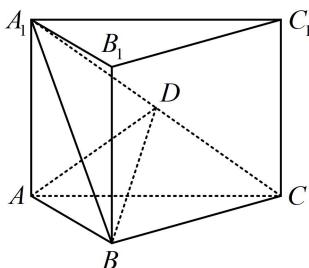
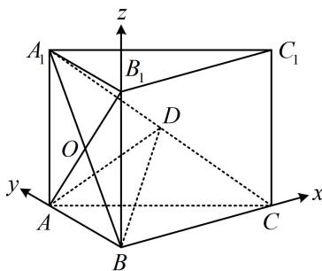

<!-- question-source:start -->
【例 3】(2022·新课标 I 卷) 如图, 直三棱柱 $ABC-A_{1}B_{1}C_{1}$ 的体积为 4, $\triangle A_{1}BC$ 的面积为 $2\sqrt{2}$ .

(1) 求点 $A$ 到平面 $A_{1} B C$ 的距离;

(2) 设 $D$ 为 $A_{1}C$ 的中点, $AA_{1} = AB$ , 平面 $A_{1}BC \perp$ 平面 $ABB_{1}A_{1}$ , 求二面角 $A - BD - C$ 的正弦值.

(1) (△ABC 的数据没给, 不便建系, 而条件中有 $\triangle A_{1}BC$ 的面积, 与所求距离合在一起可算三棱锥 $A - A_{1}BC$ 的体积, 该三棱锥的体积又可由给出的三棱柱体积求出, 故可建立方程求得目标) 记 $\triangle ABC$ 的面积为 $S$ , 点 $A_{1}$ 到平面 $ABC$ 的距离为 $h$ , 则三棱柱 $ABC - A_{1}B_{1}C_{1}$ 的体积 $V = Sh = 4$ , 所以三棱锥 $A_{1} - ABC$ 的体积 $V_{A_{1} - ABC} = \frac{1}{3} S_{\triangle ABC} \cdot h = \frac{1}{3} Sh = \frac{4}{3}$ , 另一方面, 设所求距离为 $d$ , 则 $V_{A - A_{1}BC} = \frac{1}{3} S_{\triangle A_{1}BC} \cdot d = \frac{1}{3} \times 2\sqrt{2} \times d = \frac{2\sqrt{2}}{3} d$ , 因为 $V_{A_{1} - ABC} = V_{A - A_{1}BC}$ , 所以 $\frac{2\sqrt{2}}{3} d = \frac{4}{3}$ , 解得: $d = \sqrt{2}$ , 故点 $A$ 到平面 $A_{1}BC$ 的距离为 $\sqrt{2}$ .

(2) (看图可猜想 $AB \perp BC$ , 若能证出它, 即可建系, 故尝试找理由. 条件中有面面垂直, 故想到作交线的垂线, 构造线面垂直, 由 $AA_{1} = AB$ 知 $ABB_{1}A_{1}$ 是正方形, $AB_{1}$ 就与交线 $A_{1}B$ 垂直, 思路浮现) 如图, 连接 $AB_{1}$ 交 $A_{1}B$ 于 $O$ , 由 $AA_{1} = AB$ 和 $ABC - A_{1}B_{1}C_{1}$ 为直三棱柱知 $ABB_{1}A_{1}$ 是正方形, 故 $AO \perp A_{1}B$ , 又平面 $A_{1}BC \perp$ 平面 $ABB_{1}A_{1}$ , 平面 $A_{1}BC \cap$ 平面 $ABB_{1}A_{1} = A_{1}B$ , $AO \subset$ 平面 $ABB_{1}A_{1}$ , 所以 $AO \perp$ 平面 $A_{1}BC$ , 因为 $BC \subset$ 平面 $A_{1}BC$ , 所以 $BC \perp AO$ , 又 $ABC - A_{1}B_{1}C_{1}$ 是直三棱柱, 所以 $BB_{1} \perp$ 平面 $ABC$ , 而 $BC \subset$ 平面 $ABC$ , 所以 $BC \perp BB_{1}$ , 因为 $AO$ , $BB_{1} \subset$ 平面 $ABB_{1}A_{1}$ , $AO \cap BB_{1} = B_{1}$ , 所以 $BC \perp$ 平面 $ABB_{1}A_{1}$ , 又 $A_{1}B$ , $AB \subset$ 平面 $ABB_{1}A_{1}$ , 所以 $BC \perp A_{1}B$ , $BC \perp AB$ , 故 $AB$ , $BC$ , $BB_{1}$ 两两垂直,

（题干没给棱长，需先求出棱长，才能建系写坐标. 可设出棱长，用题干的体积、面积来建立方程设 AB = a, BC = b，则 $AA_{1} = a$ , $A_{1}B = \sqrt{2}a$ ，由题意，三棱柱 $ABC - A_{1}B_{1}C_{1}$ 的体积 $V = \frac{1}{2}a^{2}b = 4$ ， $S_{\triangle A_{1}BC}=\frac{1}{2}A_{1}B\cdot BC=\frac{1}{2}\times\sqrt{2}a\times b=2\sqrt{2}$ ，解得：a=b=2，
以 B 为原点建立如图所示的空间直角坐标系，则 $A(0,2,0)$ ， $B(0,0,0)$ ， $C(2,0,0)$ ， $D(1,1,1)$ ，
所以 $\overrightarrow{BA}=(0,2,0)$ ， $\overrightarrow{BD}=(1,1,1)$ ， $\overrightarrow{BC}=(2,0,0)$ 设平面 ABD 和平面 BCD 的法向量分别为 $m=(x_{1},y_{1},z_{1})$ ， $n=(x_{2},y_{2},z_{2})$ ，
则 $\left\{\begin{aligned}&m\cdot\overrightarrow{BA}=2y_{1}=0\\ &m\cdot\overrightarrow{BD}=x_{1}+y_{1}+z_{1}=0\end{aligned}\right.$ ，令 $x_{1}=1$ ，则 $\left\{\begin{aligned}y_{1}=0\\ z_{1}=-1\end{aligned}\right.$ ，所以 $m=(1,0,-1)$ 是平面 ABD 的一个法向量，

$\left\{ \begin{array}{l} \boldsymbol{n} \cdot \overrightarrow{BD} = x_{2} + y_{2} + z_{2} = 0 \\ \boldsymbol{n} \cdot \overrightarrow{BC} = 2x_{2} = 0 \end{array} \right.$ ，令 $y_{2} = 1$ ，则 $\left\{ \begin{array}{l} x_{2} = 0 \\ z_{2} = -1 \end{array} \right.$ ，

所以 $\boldsymbol{n}=(0,1,-1)$ 是平面 BCD 的一个法向量，
从而 $\left|\cos<m,\boldsymbol{n}\right|=\frac{\left|\boldsymbol{m}\cdot\boldsymbol{n}\right|}{\left|\boldsymbol{m}\right|\cdot\left|\boldsymbol{n}\right|}=\frac{1}{2}$ 故二面角 A-BD-C 的正弦值为 $\sqrt{1-\left(\frac{1}{2}\right)^{2}}=\frac{\sqrt{3}}{2}$ .

【反思】①本题几何部分用到了多种技巧，综合性较强，所以前面的几何法要学扎实，一旦顺利建系，后续求二面角则是流程化的操作；②若是求二面角的正弦值，则无需考虑二面角的钝锐，正弦都为正.
<!-- question-source:end -->

![[高中/总复习/教辅/一数常规版2026/第9章 立体几何、空间向量/模块3 空间向量及其应用/第2节 空间向量的应用：证平行、垂直与求角/类型03_用空间向量求二面角/例题/answers/Q00050610A1.md]]
