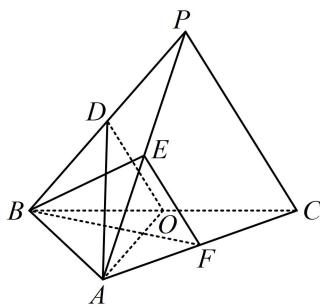
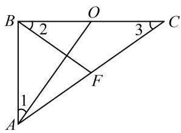
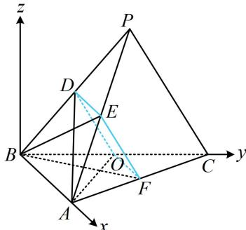

<!-- question-source:start -->
【变式】（2023·全国乙卷）在三棱锥 $P - ABC$ 中， $AB \perp BC$ ， $AB = 2$ ， $BC = 2\sqrt{2}$ ， $PB = PC = \sqrt{6}$ ， $BP$ ， $AP$ ， $BC$ 的中点分别为 $D$ ， $E$ ， $O$ ， $AD = \sqrt{5}DO$ ，点 $F$ 在 $AC$ 上， $BF \perp AO$ 。

(1) 证明: $EF \parallel$ 平面 $ADO$ ;

(2) 证明: 平面 $ADO \perp$ 平面 $BEF$ ;

(3) 求二面角 D-AO-C 的大小.

（1）（由图可猜想 DEFO 是平行四边形，故尝试证 DE 平行且等于 OF. 注意到 D, E, O 都是所在棱的中点，故若能证出 F 是中点，则 DE, OF 都平行且等于 AB 的一半，问题就解决了. 那 F 的位置由哪个条件决定呢？显然是

$BF \perp AO$ ，于是我们到 $\triangle ABC$ 中来进行分析）

如图1, 在 $\triangle ABC$ 中, 因为 $BF \perp AO$ , $AB \perp BC$ , 所以 $\angle 2 + \angle AOB = \angle 1 + \angle AOB = 90^\circ$ , 故 $\angle 1 = \angle 2$ ①, 又 $AB = 2$ , $BC = 2\sqrt{2}$ , $O$ 为 $BC$ 中点, 所以 $BO = \sqrt{2}$ , 故 $\tan \angle 1 = \frac{BO}{AB} = \frac{\sqrt{2}}{2}$ , $\tan \angle 3 = \frac{AB}{BC} = \frac{\sqrt{2}}{2}$ ,

所以 $\tan \angle 1 = \tan \angle 3$ ，故 $\angle 1 = \angle 3$ ，结合①可得 $\angle 2 = \angle 3$ ，所以 $BF = CF$

连接 $OF$ ，因为 $O$ 是 $BC$ 中点，所以 $OF \perp BC$ ，又 $AB \perp BC$ ，所以 $OF \parallel AB$

结合 $O$ 为 $BC$ 中点可得 $F$ 为 $AC$ 的中点，又 $D, E, O$ 分别是 $BP, AP, BC$ 的中点，

所以 $DE$ 和 $OF$ 都平行且等于 $AB$ 的一半，故 $DE$ 平行且等于 $OF$ ，

所以四边形 DOFE 是平行四边形，故 $EF \parallel DO$ ，

因为 $EF \not\subset$ 平面 $ADO, DO \subset$ 平面 $ADO$ , 所以 $EF \parallel$ 平面 $ADO$ .

（2）（要证面面垂直，先找线面垂直，条件中有 $AO \perp BF$ ，于是不外乎考虑证 $AO \perp$ 面 $BEF$ 或证 $BF \perp$ 面 $AOD$ ，怎样选择呢？此时我们再看其他条件，还没用过的条件就是一些长度，长度类条件用于证垂直，想到勾股定理，我们先分析有关线段的长度）由题意， $DO = \frac{1}{2} PC = \frac{\sqrt{6}}{2}$ ， $AD = \sqrt{5} DO = \frac{\sqrt{30}}{2}$ ， $AO = \sqrt{AB^2 + OB^2} = \sqrt{6}$ ，所以 $AO^2 + DO^2 = \frac{15}{2} = AD^2$ ，故 $AO \perp OD$ ，（此时结合 $OD // EF$ 我们发现可以证明 $AO \perp$ 面 $BEF$ ）由
（1）可得 $EF // OD$ ，所以 $AO \perp EF$ ，又 $AO \perp BF$ ，且 $BF$ ， $EF$ 是平面 $BEF$ 内的相交直线，所以 $AO \perp$ 平面 $BEF$ ，因为 $AO \subset$ 平面 $ADO$ ，所以平面 $ADO \perp$ 平面 $BEF$ .

(3)（此图让我们感觉面 $PBC \perp$ 面 $ABC$ ，若这一感觉正确，那建系处理就很方便。我们先分析看是不是这样的。假设面 $PBC \perp$ 面 $ABC$ ，由于 $AB \perp BC$ ，于是 $AB \perp BC$ ，故 $AB \perp BD$ ，但我们只要稍加计算，就会发现 $AB^2 + BD^2 \neq AD^2$ ，矛盾，所以我们的感觉是不对的，那么 $P$ 的坐标就不好找，怎么办呢？此时我们可以设 $P$ 的坐标，用已知的长度条件来建立方程组，直接求解 $P$ 的坐标）以 $B$ 为原点建立如图2所示的空间直角坐标系，则 $B(0,0,0)$ ， $A(2,0,0)$ ， $C(0,2\sqrt{2},0)$ ， $O(0,\sqrt{2},0)$ ，设 $P(x,y,z)(z > 0)$ ，则 $D\left(\frac{x}{2},\frac{y}{2},\frac{z}{2}\right)$ ，由 $\begin{cases} PB = \sqrt{6} \\ PC = \sqrt{6} \end{cases}$ 可得 $\begin{cases} x^2 + y^2 + z^2 = 6 \\ x^2 + (y - 2\sqrt{2})^2 + z^2 = 6 \end{cases}$ ，解得： $y = \sqrt{2}$ ，代回两方程中的任意一个可得 $x^2 + z^2 = 4$ ②，（此时发现还有 $AD = \sqrt{5}DO$ 这个条件没用，故翻译它）又 $AD = \sqrt{5}DO$ ，所以 $\left(\frac{x}{2} - 2\right)^2 + \frac{y^2}{4} + \frac{z^2}{4} = 5\left[\frac{x^2}{4} + \left(\frac{y}{2} - \sqrt{2}\right)^2 + \frac{z^2}{4}\right]$ ，将 $y = \sqrt{2}$ 代入整理得： $x^2 + z^2 + 2x - 2 = 0$ ③，联立②③结合 $z > 0$ 解得： $x = -1$ ， $z = \sqrt{3}$ ，（到此本题的主要难点就攻克了，接下来是流程化的计算）所以 $D\left(-\frac{1}{2},\frac{\sqrt{2}}{2},\frac{\sqrt{3}}{2}\right)$ ，故 $\overrightarrow{DO} = \left(\frac{1}{2},\frac{\sqrt{2}}{2},-\frac{\sqrt{3}}{2}\right)$ ， $\overrightarrow{AO} = (-2,\sqrt{2},0)$ ，设平面 $AOD$ 的法向量为 $m = (x,y,z)$ ，则 $\begin{cases} m \cdot \overrightarrow{DO} = \frac{1}{2}x + \frac{\sqrt{2}}{2}y - \frac{\sqrt{3}}{2}z = 0 \\ m \cdot \overrightarrow{AO} = -2x + \sqrt{2}y = 0 \end{cases}$ ，令 $x = 1$ ，则 $\begin{cases} y = \sqrt{2} \\ z = \sqrt{3} \end{cases}$ ，所以 $m = (1,\sqrt{2},\sqrt{3})$ 是平面 $AOD$ 的一个法向量，由图可知 $n = (0,0,1)$ 是平面 $AOC$ 的一个法向量，所以 $\cos < m, n > = \frac{m \cdot n}{|m| \cdot |n|} = \frac{\sqrt{2}}{2}$ ，由图可知二面角 $D - AO - C$ 为钝角，故其大小为 $135^\circ$ 。

  
图1

  
图2

【反思】①若由图能看出二面角的钝锐，则直接看图决定怎样取值；否则可将法向量取成一个朝内，一个朝外，它们的夹角即为二面角；②通过本题我们给出了一种额外的找坐标思路，即当建系后有点的坐标不好找时，可直接设其坐标，翻译已知的各种条件（本题是长度）建立方程组，求解该坐标.
<!-- question-source:end -->

![[高中/总复习/教辅/一数常规版2026/第9章 立体几何、空间向量/模块3 空间向量及其应用/第2节 空间向量的应用：证平行、垂直与求角/类型03_用空间向量求二面角/例题/answers/Q00050612A1.md]]
