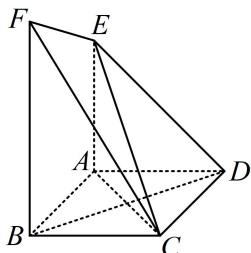
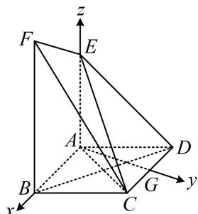

> [!faq]- 《第2节 空间向量的应用：证平行、垂直与求角》例题解析
>
> > [!success]- **【答案】** 详见解析
>
> > [!note]- **【分析】**
> > 本题未单列分析。
>
> > [!note]- **【解析】**
> > 证明: $BD \perp$ 平面 $ACE$ ;
> >
> > （2）若平面 $CEF$ 与平面 $ABFE$ 的夹角的余弦值为 $\frac{\sqrt{10}}{4}$ ，求 $BF$ 的长.
> >
> > 
> >
> > 解:
> > (1) (证线面垂直, 需在面内找线, $BD \perp AC$ 容易看出, 而由图可猜想 $AE \perp$ 平面 $ABCD$ , 故另一条选 $AE$ ) 由题意, $AE^{2} + AD^{2} = 8 = DE^{2}$ , 所以 $AE \perp AD$ ,
> >
> > 又平面 $ADE \perp$ 平面 $ABCD$ ，平面 $ADE \cap$ 平面 $ABCD = AD$ ， $AE \subset$ 平面 $ADE$ ，所以 $AE \perp$ 平面 $ABCD$ ，因为 $BD \subset$ 平面 $ABCD$ ，所以 $BD \perp AE$ ，又四边形 $ABCD$ 是菱形，所以 $BD \perp AC$ ，因为 $AE$ ， $AC \subset$ 平面 $ACE$ ， $AE \cap AC = A$ ，所以 $BD \perp$ 平面 $ACE$ .
> >
> > (2) (第1问已证出了 $AE \perp$ 平面ABCD, 第2问可直接建系) 取 $CD$ 中点 $G$ , 连接 $AG$ ,
> >
> > $$
> > \angle A B C = 6 0 ^ {\circ}
> > $$
> >
> > $$
> > \triangle A B C \text {和} \triangle A C D
> > $$
> >
> > $$
> > A G \perp C D
> > $$
> >
> > $$
> > A B \mathbin {/ /} C D
> > $$
> >
> > $$
> > A G \perp A B
> > $$
> >
> > $$
> > A E \perp
> > $$
> >
> > $$
> > A B C D
> > $$
> >
> > $$
> > B F = a (a > 0)
> > $$
> >
> > $$
> > C (1, \sqrt {3}, 0)
> > $$
> >
> > $$
> > F (2, 0, a)
> > $$
> >
> > $$
> > \overrightarrow {C E} = (- 1, - \sqrt {3}, 2)
> > $$
> >
> > $$
> > \overrightarrow {C F} = (1, - \sqrt {3}, a)
> > $$
> >
> > $$
> > \boldsymbol {n} = (x, y, z)
> > $$
> >
> > 则 $\left\{ \begin{array}{l} \pmb{n} \cdot \overrightarrow{CE} = -x - \sqrt{3}y + 2z = 0 \\ \pmb{n} \cdot \overrightarrow{CF} = x - \sqrt{3}y + az = 0 \end{array} \right.$ ，两式相减得： $-2x + (2 - a)z = 0$ ，令 $x = 2 - a$ ，则 $z = 2$ ，
> >
> > 代入原方程组可得 $y = \frac{2 + a}{\sqrt{3}}$ ，（为了便于后续计算，我们把求得的 $x, y, z$ 同乘以 $\sqrt{3}$ 去分母）
> >
> > 所以 $\pmb{n} = (\sqrt{3}(2 - a), 2 + a, 2\sqrt{3})$ 是平面 $CEF$ 的一个法向量，
> >
> > 由图可知 $AG \perp$ 平面 $ABFE$ ，所以 $\overrightarrow{AG} = (0, \sqrt{3}, 0)$ 是平面 $ABFE$ 的一个法向量，因为平面 $CEF$ 与平面 $ABFE$ 的夹角余弦值为 $\frac{\sqrt{10}}{4}$ ，所以 $\left|\cos < \overrightarrow{AG}, n >\right| = \frac{\left|\overrightarrow{AG} \cdot n\right|}{\left|\overrightarrow{AG}\right| \cdot |n|} = \frac{\sqrt{3}(2 + a)}{\sqrt{3(2 - a)^2 + (2 + a)^2 + 12} \cdot \sqrt{3}} = \frac{\sqrt{10}}{4}$ ，
> >
> > 
> >
> > 解得： $a = 3$ ，故 $BF = 3$
>
> > [!tip]- **【反思】**
> > 两个平面（不考虑平行和垂直的情况）的夹角一定是锐角，所以计算面面的夹角余弦，直接在法向量的夹角余弦上取绝对值.
