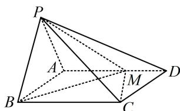

<!-- question-source:start -->
1. (2023·山西模拟·★★★)

如图, 在四棱锥 $P - ABCD$ 中, 平面 $PAB \perp$ 平面 $ABCD$ , 底面 $ABCD$ 为矩形, $PA = PB = \sqrt{5}$ , $AB = 2$ , $AD = 3$ , $M$ 是棱 $AD$ 上一点, 且 $AM = 2MD$ .

(1) 求点 B 到直线 PM 的距离;

(2) 求平面 PMB 与平面 PMC 的夹角余弦值.

<!-- question-source:end -->

![[Q00050621A1]]
