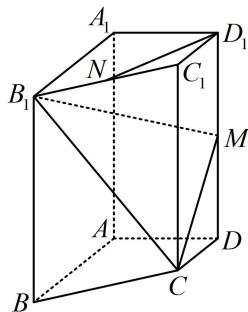

<!-- question-source:start -->
2. (2024·天津卷·★★★)

已知四棱柱 $ABCD - A_{1}B_{1}C_{1}D_{1}$ 中，底面 $ABCD$ 为梯形， $AB \parallel CD$ ， $A_{1}A \perp$ 平面 $ABCD$ ， $AD \perp AB$ ，其中 $AB = AA_{1} = 2$ ， $AD = DC = 1$ ， $N$ 是 $B_{1}C_{1}$ 的中点， $M$ 是 $DD_{1}$ 的中点.

（1）求证： $D_{1}N / /$ 平面 $CB_{1}M$

(2) 求平面 $CB_{1}M$ 与平面 $BB_{1}C_{1}C$ 的夹角余弦值;

(3) 求点 B 到平面 $CB_{1}M$ 的距离.

## 一数·必刷100讲
<!-- question-source:end -->

![[Q00050622A1]]
