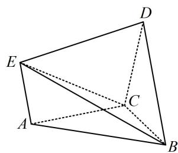

<!-- question-source:start -->
## 3. (2023·四川泸县模拟·★★★)

如图，在多面体 $ABCDE$ 中， $\triangle ABC$ ， $\triangle BCD$ ， $\triangle CDE$ 都是边长为 2 的正三角形，平面 $ABC \perp$ 平面 $BCD$ ，平面 $CDE \perp$ 平面 $BCD$ .

(1) 求证: $AE \parallel BD$ ;

(2) 求点 B 到平面 ACE 的距离.

<!-- question-source:end -->

![[Q00050623A1]]
