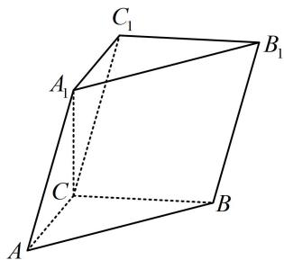

<!-- question-source:start -->
4. (2023·全国甲卷·★★★★)

在三棱柱 $ABC - A_{1}B_{1}C_{1}$ 中， $AA_{1} = 2$ ， $A_{1}C \perp$ 底面 $ABC$ ， $\angle ACB = 90^{\circ}$ ， $A_{1}$ 到平面 $BCC_{1}B_{1}$ 的距离为1.

（1）证明： $AC = A_{1}C$

（2）若直线 $AA_{1}$ 与 $BB_{1}$ 的距离为2，求 $AB_{1}$ 与平面 $BCC_{1}B_{1}$ 所成角的正弦值.

一数·必刷100讲
<!-- question-source:end -->

![[Q00050624A1]]
