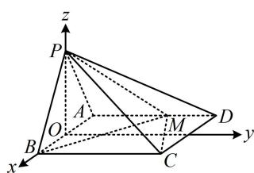

> [!faq]- 《第3节 空间向量的应用：求距离》参考答案
>
> > [!success]- **【答案】** 详见解析
>
> > [!note]- **【分析】**
> > 本题未单列分析。
>
> > [!note]- **【解析】**
> > 解：（1）（条件中有平面 $PAB \perp$ 平面 $ABCD$ ，先找与交线 $AB$ 垂直的直线，构造线面垂直，便于建系处理）
> > 取 $AB$ 中点 $O$ ，连接 $OP$ ，因为 $PA = PB = \sqrt{5}$ ， $AB = 2$ ，所以 $OP \perp AB$ ，且 $OA = OB = 1$ ， $OP = \sqrt{PB^2 - OB^2} = 2$ ，因为平面 $PAB \perp$ 平面 $ABCD$ ，平面 $PAB \cap$ 平面 $ABCD = AB$ ， $OP \subset$ 平面 $PAB$ ， $OP \perp AB$ ，所以 $OP \perp$ 平面 $ABCD$ ，建立如图所示的空间直角坐标系，则 $B(1,0,0)$ ， $P(0,0,2)$ ，因为 $AM = 2MD$ ， $AD = 3$ ，所以 $AM = 2$ ，故 $M(-1,2,0)$ ，所以 $\overrightarrow{BP} = (-1,0,2)$ ， $\overrightarrow{PM} = (-1,2,-2)$ ，
> >
> > $$
> > \boldsymbol {u} = \frac {\overrightarrow {P M}}{| \overrightarrow {P M} |} = \left(- \frac {1}{3}, \frac {2}{3}, - \frac {2}{3}\right)
> > $$
> >
> > $$
> > d = \sqrt {\overrightarrow {B P} ^ {2} - (\overrightarrow {B P} \cdot \boldsymbol {u}) ^ {2}} = \sqrt {5 - (- 1) ^ {2}} = 2.
> > $$
> >
> > $$
> > \overrightarrow {M C} = (2, 1, 0)
> > $$
> >
> > $$
> > \boldsymbol {m} = \left(x _ {1}, y _ {1}, z _ {1}\right)
> > $$
> >
> > $$
> > \left\{ \begin{array}{l} \boldsymbol {m} \cdot \overrightarrow {B P} = - x _ {1} + 2 z _ {1} = 0 \\ \boldsymbol {m} \cdot \overrightarrow {P M} = - x _ {1} + 2 y _ {1} - 2 z _ {1} = 0 \end{array} \right.
> > $$
> >
> > $$
> > x _ {1} = 2
> > $$
> >
> > $$
> > \boldsymbol {n} = \left(x _ {2}, y _ {2}, z _ {2}\right)
> > $$
> >
> > $$
> > \left\{ \begin{array}{l} y _ {1} = 2 \\ z _ {1} = 1 \end{array} \right.
> > $$
> >
> > 所以平面 PMB 的一个法向量为 $\boldsymbol{m} = (2, 2, 1)$ ,
> >
> > $\left\{ \begin{array}{l} \pmb{n} \cdot \overrightarrow{PM} = -x_{2} + 2y_{2} - 2z_{2} = 0 \\ \pmb{n} \cdot \overrightarrow{MC} = 2x_{2} + y_{2} = 0 \end{array} \right.$ ，令 $x_{2} = 2$ ，则 $\left\{ \begin{array}{l} y_{2} = -4 \\ z_{2} = -5 \end{array} \right.$ ，
> >
> > 所以平面 PMC 的一个法向量为 $\boldsymbol{n}=(2,-4,-5)$ ,
> >
> > 从而 $|\cos < m, n >| = \frac{|m \cdot n|}{|m| \cdot |n|} = \frac{\sqrt{5}}{5}$
> >
> > 故平面 PMB 与平面 PMC 的夹角余弦值为 $\frac{\sqrt{5}}{5}$ .
> >
> > 
