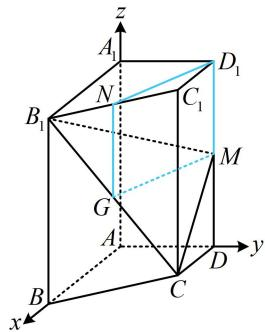

> [!faq]- 《第3节 空间向量的应用：求距离》参考答案
>
> > [!success]- **【答案】** 详见解析
>
> > [!note]- **【分析】**
> > 本题未单列分析。
>
> > [!note]- **【解析】**
> > 解：（1）（证线面平行，先找线线平行。如图，将 $ND_{1}$ 移至 $MG$ 处，则 $MGND_{1}$ 像平行四边形，思路就有了）如图，取 $B_{1}C$ 中点 $G$ ，因为 $N$ 是 $B_{1}C_{1}$ 的中点，所以 $NG \parallel CC_{1}$ 且 $NG = \frac{1}{2} CC_{1}$ ，又 $ABCD - A_{1}B_{1}C_{1}D_{1}$ 为四棱柱，且 $M$ 是 $DD_{1}$ 的中点，所以 $D_{1}M \parallel CC_{1}$ 且 $D_{1}M = \frac{1}{2} CC_{1}$ ，从而 $D_{1}M \parallel NG$ ，且 $D_{1}M = NG$ ，故四边形 $MGND_{1}$ 是平行四边形，所以 $ND_{1} \parallel MG$ ，因为 $ND_{1} \subsetneq$ 平面 $CB_{1}M$ ， $MG \subset$ 平面 $CB_{1}M$ ，所以 $ND_{1} \parallel$ 平面 $CB_{1}M$ 。
> >
> > (2) (算夹角余弦, 考虑建系, 图形本身就有 $AB$ , $AD$ , $AA_{1}$ 两两垂直, 可直接建系)
> >
> > $$
> > B _ {1} (2, 0, 2), \quad B (2, 0, 0), \quad C (1, 1, 0), \quad M (0, 1, 1)
> > $$
> >
> > $$
> > \overrightarrow {B B _ {1}} = (0, 0, 2), \quad \overrightarrow {C B _ {1}} = (1, - 1, 2), \quad \overrightarrow {M C} = (1, 0, - 1)
> > $$
> >
> > 设平面 $BB_{1}C_{1}C$ 和平面 $CB_{1}M$ 的法向量分别为
> >
> > $$
> > \boldsymbol {m} = \left(x _ {1}, y _ {1}, z _ {1}\right), \quad \boldsymbol {n} = \left(x _ {2}, y _ {2}, z _ {2}\right)
> > $$
> >
> > 则 $\left\{ \begin{array}{l} \pmb{m} \cdot \overrightarrow{BB_1} = 2z_1 = 0 \\ \pmb{m} \cdot \overrightarrow{CB_1} = x_1 - y_1 + 2z_1 = 0 \end{array} \right.$ ，令 $x_1 = 1$ ，则 $\left\{ \begin{array}{l} y_1 = 1 \\ z_1 = 0 \end{array} \right.$ ，
> >
> > $$
> > \boldsymbol {m} = (1, 1, 0)
> > $$
> >
> > $$
> > B B _ {1} C _ {1} C
> > $$
> >
> > 又 $\left\{ \begin{array}{l} \pmb{n} \cdot \overrightarrow{CB_1} = x_2 - y_2 + 2z_2 = 0 \\ \pmb{n} \cdot \overrightarrow{MC} = x_2 - z_2 = 0 \end{array} \right.$ ，令 $x_2 = 1$ ，则 $\left\{ \begin{array}{l} y_2 = 3 \\ z_2 = 1 \end{array} \right.$ ，
> >
> > 所以 $\boldsymbol{n}=(1,3,1)$ 是平面 $CB_{1}M$ 的一个法向量，
> >
> > 设平面 $CB_{1}M$ 与平面 $BB_{1}C_{1}C$ 的夹角为 $\theta$
> >
> > $$
> > \left| = \frac {\left| \boldsymbol {m} \cdot \boldsymbol {n} \right|}{\left| \boldsymbol {m} \right| \cdot \left| \boldsymbol {n} \right|} = \frac {4}{\sqrt {2} \times \sqrt {1 1}} = \frac {2 \sqrt {2 2}}{1 1} \right.
> > $$
> >
> > 所以平面 $CB_{1}M$ 与平面 $BB_{1}C_{1}C$ 的夹角余弦值为 $\frac{2\sqrt{22}}{11}$
> >
> > (3) (已有 $\overrightarrow{BB_1}$ 和平面 $CB_{1}M$ 的法向量, 可直接代公式求 $B$ 到平面 $CB_{1}M$ 的距离) 设点 $B$ 到平面 $CB_{1}M$ 的距离为 $d$ ,
> >
> > 则 $d = \frac{\left|\overrightarrow{BB_1} \cdot \boldsymbol{n}\right|}{\left|\boldsymbol{n}\right|} = \frac{2}{\sqrt{11}} = \frac{2\sqrt{11}}{11}$ .
> >
> > 
