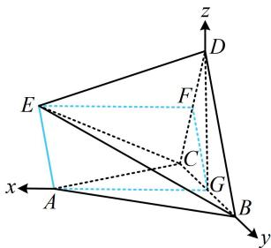

> [!faq]- 《第3节 空间向量的应用：求距离》参考答案
>
> > [!success]- **【答案】** 详见解析
>
> > [!note]- **【分析】**
> > 本题未单列分析。
>
> > [!note]- **【解析】**
> > 解: (1) (有两个面面垂直, 想到作交线的垂线构造线面垂
> >
> > 直，作出来就发现有平行四边形）  
> > 如图，取 $BC$ 中点 $G$ ， $CD$ 中点 $F$ ，连接 $EF$ ， $FG$ ， $AG$ 因为 $\triangle ABC$ ， $\triangle CDE$ 是边长为2的正三角形，所以 $AG = EF = \sqrt{3}$ ，且 $AG\bot BC$ ， $EF\bot CD$ 又平面 $ABC\bot$ 平面 $BCD$ ，平面 $ABC\cap$ 平面 $BCD = BC$ ， $AG\subset$ 平面 $ABC$ ，所以 $AG\bot$ 平面 $BCD$ 同理，由平面 $CDE\bot$ 平面 $BCD$ 可得 $EF\bot$ 平面 $BCD$ 所以 $EF//AG$ 且 $EF = AG$ ，故四边形AEFG是平行四边形，所以 $AE//FG$ ，又 $FG//BD$ ，所以 $AE//BD.$
> >
> > (2) 连接 $DG$ , 则 $DG \perp BC$ , 结合平面 $ABC \perp$ 平面 $BCD$ 可得 $DG \perp$ 平面 $ABC$ , 所以 $AG$ , $GB$ , $GD$ 两两垂直,
> >
> > 以 $G$ 为原点建立如图所示的空间直角坐标系，
> >
> > 则 $B(0,1,0)$ ， $A(\sqrt{3},0,0)$ ， $C(0, - 1,0)$ ， $D(0,0,\sqrt{3})$
> >
> > 所以 $\overrightarrow{CB} = (0,2,0)$ ， $\overrightarrow{CA} = (\sqrt{3},1,0)$
> >
> > （求平面 $ACE$ 的法向量还需 $\overrightarrow{AE}$ 或 $\overrightarrow{CE}$ ，不妨用 $\overrightarrow{AE}$ ，若写 $E$ 的坐标，就得找它在面 $ABC$ 内的投影，较为麻烦，可借助平行关系将 $\overrightarrow{AE}$ 转化为好算的向量来求，如 $\overrightarrow{BD}$ ）
> >
> > 由（1）可得 $\overrightarrow{AE} = \overrightarrow{GF} = \frac{1}{2}\overrightarrow{BD} = \frac{1}{2}(0, - 1,\sqrt{3}) = \left(0, - \frac{1}{2},\frac{\sqrt{3}}{2}\right),$
> >
> > 设平面 ACE 的法向量为 $\boldsymbol{n}=(x,y,z)$ ,
> >
> > 则 $\left\{ \begin{array}{l} \pmb{n} \cdot \overrightarrow{CA} = \sqrt{3} x + y = 0 \\ \pmb{n} \cdot \overrightarrow{AE} = -\frac{1}{2} y + \frac{\sqrt{3}}{2} z = 0 \end{array} \right.$ ，令 $x = 1$ ，则 $\left\{ \begin{array}{l} y = -\sqrt{3} \\ z = -1 \end{array} \right.$ ，
> >
> > 所以 $\boldsymbol{n}=(1,-\sqrt{3},-1)$ 是平面 ACE 的一个法向量，
> >
> > 故点 $B$ 到平面 $ACE$ 的距离 $d = \frac{\left|\overrightarrow{CB} \cdot \boldsymbol{n}\right|}{\left|\boldsymbol{n}\right|} = \frac{2\sqrt{15}}{5}$ .
> >
> > 
>
> > [!tip]- **【反思】**
> > 在求向量坐标时，若遇到某些点的坐标不好找，不妨考虑借助平行关系转化为好求的向量来算.
