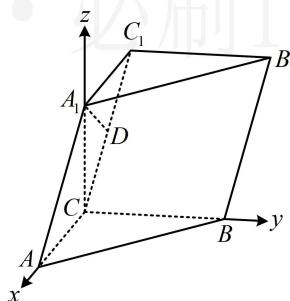

> [!faq]- 《第3节 空间向量的应用：求距离》参考答案
>
> > [!success]- **【答案】** 详见解析
>
> > [!note]- **【分析】**
> > 本题未单列分析。
>
> > [!note]- **【解析】**
> > 解：（1）（题干给出 $A_{1}$ 到面 $BCC_{1}B_{1}$ 的距离为1，此条件怎
> >
> > 么用？由题意不难发现 $BC \perp$ 面 $ACC_{1}A_{1}$ ，于是面 $BCC_{1}B_{1} \perp$ 面 $ACC_{1}A_{1}$ ，故由面面垂直的性质定理，过 $A_{1}$ 易作面 $BCC_{1}B_{1}$ 的垂线，只需作交线 $CC_{1}$ 的垂线即可）
> >
> > 如图，作 $A_{1}D \perp CC_{1}$ 于点 $D$ ，由题意， $A_{1}C \perp$ 平面 $ABC$
> >
> > $BC \subset$ 平面 ABC，所以 $BC \perp A_{1}C$ ，
> >
> > 又 $BC \perp AC$ ，且 AC， $A_{1}C \subset$ 平面 $ACC_{1}A_{1}$ ，
> >
> > $AC \cap A_{1}C = C$ ，所以 $BC \perp$ 平面 $ACC_{1}A_{1}$
> >
> > 因为 $A_{1}D \subset$ 平面 $ACC_{1}A_{1}$ ，所以 $A_{1}D \perp BC$ ，
> >
> > 结合 $A_{1}D \perp CC_{1}$ 可得 $A_{1}D \perp$ 平面 $BCC_{1}B_{1}$ ，
> >
> > (由 $A_{1}D$ 的长恰为 $CC_{1}$ 的一半可联想到直角三角形斜边上的中线等于斜边的一半，由此能证 $A_{1}D$ 是中线，根据三线合一就可证得 $A_{1}C = A_{1}C_{1}$ ，故结论成立)
> >
> > 因为 $A_{1}$ 到平面 $BCC_{1}B_{1}$ 的距离为1，所以 $A_{1}D = 1$
> >
> > 又 $AA_{1}=2$ ，所以 $CC_{1}=2$ ，
> >
> > 由 $A_{1}C \perp$ 平面 $ABC$ 可得 $A_{1}C \perp AC$ ，又 $A_{1}C_{1} // AC,$
> >
> > 所以 $A_{1}C \perp A_{1}C_{1}$ ，结合 $A_{1}D = \frac{1}{2} CC_{1}$ 得 $D$ 为 $CC_{1}$ 的中点，
> >
> > 又 $A_{1}D \perp CC_{1}$ ，所以 $A_{1}C = A_{1}C_{1}$ ，
> >
> > 因为 $AC = A_{1}C_{1}$ ，所以 $A_{1}C = AC$ 。
> >
> > （2）（条件中本身就有三条两两垂直的直线，故可直接建系处理）以 $C$ 为原点建立如图所示的空间直角坐标系，由（1）的结论可得 $\triangle AA_{\mathrm{t}}C$ 是等腰直角三角形，
> >
> > 因为 $AA_{1} = 2$ ，所以 $AC = A_{1}C = \sqrt{2}$
> >
> > (要写涉及到的点的坐标, 还差 $BC$ 的长, 可设为未知数, 用直线 $AA_{1}$ 与 $BB_{1}$ 的距离为 2 来求解)
> >
> > 设 $BC = a(a > 0)$ ，则 $A(\sqrt{2},0,0)$ ， $A_{1}(0,0,\sqrt{2})$ ， $B(0,a,0)$
> >
> > 所以 $\overrightarrow{AA_1} = (-\sqrt{2},0,\sqrt{2})$ ， $\overrightarrow{AB} = (-\sqrt{2},a,0)$
> >
> > 故直线 $AA_{1}$ 的单位方向向量为 $\boldsymbol{u}=\left(-\frac{\sqrt{2}}{2},0,\frac{\sqrt{2}}{2}\right)$ ,
> >
> > 它也是直线 $BB_{1}$ 的方向向量，所以点 $A$ 到直线 $BB_{1}$ 的距离
> >
> > $$
> > d = \sqrt {\overrightarrow {A B} ^ {2} - (\overrightarrow {A B} \cdot \boldsymbol {u}) ^ {2}} = \sqrt {2 + a ^ {2} - 1} = \sqrt {a ^ {2} + 1},
> > $$
> >
> > 因为直线 $AA_{1}$ 与 $BB_{1}$ 的距离为2，所以点 $A$ 到直线 $BB_{1}$ 的距离为2，即 $\sqrt{a^2 + 1} = 2$ ，从而 $a = \sqrt{3}$ ，故 $B(0, \sqrt{3}, 0)$ （求目标需用 $B_{1}$ ， $C_{1}$ 的坐标，找它们在面 $ABC$ 的投影较麻烦，可用向量的线性运算来回避这一难点）
> >
> > $$
> > \overrightarrow {C B} = (0, \sqrt {3}, 0), \quad \overrightarrow {C C _ {1}} = \overrightarrow {A A _ {1}} = (- \sqrt {2}, 0, \sqrt {2})
> > $$
> >
> > $$
> > \overrightarrow {A B _ {1}} = \overrightarrow {A B} + \overrightarrow {B B _ {1}} = \overrightarrow {A B} + \overrightarrow {A A _ {1}} = (- \sqrt {2}, \sqrt {3}, 0) + (- \sqrt {2}, 0, \sqrt {2})
> > $$
> >
> > $= (-2\sqrt{2},\sqrt{3},\sqrt{2})$ ，设平面 $BCC_{1}B_{1}$ 的法向量为 $\pmb {n} = (x,y,z)$
> >
> > 则 $\left\{ \begin{array}{l} \pmb{n} \cdot \overrightarrow{CB} = \sqrt{3} y = 0 \\ \pmb{n} \cdot \overrightarrow{CC_1} = -\sqrt{2} x + \sqrt{2} z = 0 \end{array} \right.$ ，令 $x = 1$ ，则 $\left\{ \begin{array}{l} y = 0 \\ z = 1 \end{array} \right.$ ，
> >
> > 所以 $\boldsymbol{n}=(1,0,1)$ 是平面 $BCC_{1}B_{1}$ 的一个法向量，
> >
> > 从而 $\left|\cos < \overrightarrow{AB_1},\pmb {n} > \right| = \frac{\left|\overrightarrow{AB_1}\cdot\pmb{n}\right|}{\left|\overrightarrow{AB_1}\right|\cdot|\pmb{n}|} = \frac{\sqrt{13}}{13},$
> >
> > 故直线 $AB_{1}$ 与平面 $BCC_{1}B_{1}$ 所成角的正弦值为 $\frac{\sqrt{13}}{13}$
> >
> > 
>
> > [!tip]- **【反思】**
> > 其实第1问也可建系翻译所给的点到平面的距离，但在未证出 $AC = A_{1}C$ 前， $AC$ ， $A_{1}C$ ， $BC$ 长度都未知，需设三个未知数，较麻烦，故没用这种方法.
