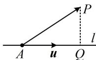
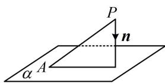
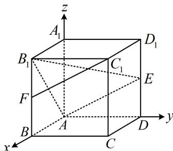

<!-- source-part:1 pages:1-4 -->

# 第 3 节 空间向量的应用：求距离（★★★）

## 内容提要

本节归纳用空间向量求距离的有关问题，常见的有下面两类：

1. 求点到直线的距离：如图1，设 $P$ 为直线 $l$ 外一点，点 $A$ 在直线 $l$ 上， $\pmb{u}$ 是直线 $l$ 的单位方向向量，则点 $P$ 到直线 $l$ 的距离 $PQ = \sqrt{\overrightarrow{AP}^2 - (\overrightarrow{AP} \cdot \pmb{u})^2}$ .

注：当线线平行时，两直线间的距离等于其中一条直线上任意一点到另一直线的距离.

2. 求点到平面的距离: 如图 2, $P$ 为平面 $\alpha$ 外一点, $A$ 为平面 $\alpha$ 上任意一点, $\pmb{n}$ 为平面 $\alpha$ 的一个法向量, 则点 $P$ 到平面 $\alpha$ 的距离 $d = \frac{|\overrightarrow{PA} \cdot \pmb{n}|}{|\pmb{n}|}$ .

  
图1

  
图2

注：当线面平行或面面平行时，直线到平面的距离，平行平面间的距离都可按点到平面的距离来算.

【例题】(多选)在棱长为1的正方体 $ABCD - A_{1}B_{1}C_{1}D_{1}$ 中, $E$ 为线段 $DD_{1}$ 的中点, $F$ 为线段 $BB_{1}$ 的中点, 则下列说法中正确的是 ( )

A. 点 $A_{1}$ 到直线 $B_{1}E$ 的距离是 $\frac{\sqrt{5}}{3}$ B. 直线 $FC_{1}$ 到直线 $AE$ 的距离是 $\frac{\sqrt{30}}{5}$ C. 点 $A_{1}$ 到平面 $AB_{1}E$ 的距离是 $\frac{\sqrt{3}}{3}$ D. 直线 $FC_{1}$ 到平面 $AB_{1}E$ 的距离是 $\frac{1}{3}$

解析：涉及的距离都可直接代内容提要公式算，正方体中也容易建系，故建系处理，如图建系，则 $A(0,0,0)$ ， $A_{1}(0,0,1)$ ， $B_{1}(1,0,1)$ ， $E\left(0,1,\frac{1}{2}\right)$ ， $F\left(1,0,\frac{1}{2}\right)$ ，A项， $\overrightarrow{A_1B_1} = (1,0,0)$ ， $\overrightarrow{B_1E} = \left(-1,1,-\frac{1}{2}\right)$ ，直线 $B_{1}E$ 的一个单位方向向量为 $\pmb{u} = \frac{\overrightarrow{B_1E}}{\left|\overrightarrow{B_1E}\right|} = \left(-\frac{2}{3},\frac{2}{3},-\frac{1}{3}\right)$ ，由内容提要1的公式，点 $A_{1}$ 到直线 $B_{1}E$ 的距离为 $\sqrt{\overrightarrow{A_1B_1}^2 - (\overrightarrow{A_1B_1}\cdot\pmb{u})^2} = \sqrt{1 - \left(-\frac{2}{3}\right)^2} = \frac{\sqrt{5}}{3}$ ，故A项正确；B项，观察发现 $FC_{1} // AE$ ，故两直线的距离可转化为点到直线的距离来算，点不妨取 $F$

$\overrightarrow{AF} = \left(1,0,\frac{1}{2}\right),\quad \overrightarrow{AE} = \left(0,1,\frac{1}{2}\right)$ ，所以直线 $AE$ 的一个单位方向向量 $\pmb {v} = \frac{\overrightarrow{AE}}{\left|\overrightarrow{AE}\right|} = \frac{2\sqrt{5}}{5}\overrightarrow{AE} = \left(0,\frac{2\sqrt{5}}{5},\frac{\sqrt{5}}{5}\right)$ 从而点 $F$ 到直线 $AE$ 的距离为 $\sqrt{\overrightarrow{AF}^2 - (\overrightarrow{AF}\cdot\pmb{v})^2} = \sqrt{\frac{5}{4} - \left(\frac{\sqrt{5}}{10}\right)^2} = \frac{\sqrt{30}}{5}$ ，故B项正确；

C项, 算点到平面的距离, 可代内容提要第2点的公式, 先求平面 $A B_{1} E$ 的法向量,

$\overrightarrow{AB_1} = (1,0,1)$ ， $\overrightarrow{AE} = \left(0,1,\frac{1}{2}\right)$ ，设平面 $AB_{1}E$ 的法向量为 $\pmb {n} = (x,y,z)$ ，则 $\left\{ \begin{array}{l}\pmb {n}\cdot \overrightarrow{AB_1} = x + z = 0\\ \pmb {n}\cdot \overrightarrow{AE} = y + \frac{1}{2} z = 0 \end{array} \right.$

令 $x = 2$ ，则 $\left\{ \begin{array}{l} y = 1 \\ z = -2 \end{array} \right.$ ，所以 $\pmb{n} = (2,1, -2)$ 是平面 $AB_{1}E$ 的一个法向量，

又 $\overrightarrow{AA_1} = (0,0,1)$ ，所以点 $A_{1}$ 到平面 $AB_{1}E$ 的距离为 $\frac{\left|\overrightarrow{AA_1} \cdot \boldsymbol{n}\right|}{\left|\boldsymbol{n}\right|} = \frac{2}{3}$ ，故C项错误；

D项，由 $FC_{1} / / AE$ 可知 $FC_{1} / /$ 平面 $AB_{1}E$ ，故线面距离可按点到平面的距离来算，

前面已求得 $\overrightarrow{AF} = \left(1,0,\frac{1}{2}\right)$ ，平面 $AB_{1}E$ 的一个法向量为 $\pmb {n} = (2,1, - 2)$ 所以点 $F$ 到平面 $AB_{1}E$ 的距离为 $\frac{\left|\overrightarrow{AF}\cdot\pmb{n}\right|}{\left|\pmb{n}\right|} = \frac{1}{3}$ 从而直线 $FC_{1}$ 到平面 $AB_{1}E$ 的距离为 $\frac{1}{3}$ ，故D项正确.

答案: ABD

【总结】向量法计算空间距离，熟悉有关公式即可，都是流程化的操作，所以本节只举一道例题.

![[高中/总复习/教辅/一数常规版2026/第9章 立体几何、空间向量/模块3 空间向量及其应用/第3节 空间向量的应用：求距离/强化训练/强化训练.md]]
