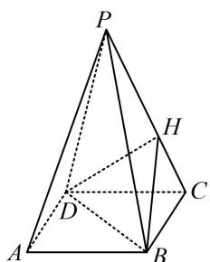

<!-- question-source:start -->
2. (2022·北京模拟·★★★)

若正四棱锥 $P - ABCD$ 的高为 4，棱 $AB$ 的长为 2，点 $H$ 为侧棱 $PC$ 上一动点，则 $\triangle HBD$ 的面积的最小值为（）

A. $\sqrt{2}$ B. $\frac{\sqrt{3}}{2}$ C. $\frac{\sqrt{2}}{3}$ D. $\frac{4\sqrt{2}}{3}$

<!-- question-source:end -->

![[Q00050633A1]]
