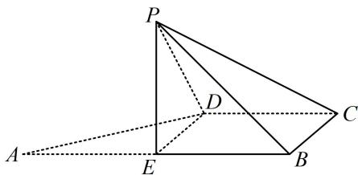

<!-- question-source:start -->
## 4. (2022·福建模拟·★★★☆) (多选)

如图，直角梯形 $ABCD$ 中， $AB \parallel CD$ ， $AB \perp BC$ ， $BC = CD = \frac{1}{2} AB = 1$ ， $E$ 为 $AB$ 中点，以 $DE$ 为折痕把 $\triangle ADE$ 折起，使点 $A$ 到达点 $P$ 的位置，使 $PC = \sqrt{3}$ ，则（）  
A. 平面 $PED \perp$ 平面 $PCD$ B. $PC \perp BD$ C. 二面角 $P - DC - B$ 的大小为 $60^{\circ}$ D. $PC$ 与平面 $PED$ 所成角为 $45^{\circ}$

<!-- question-source:end -->

![[Q00050635A1]]
