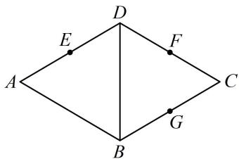

<!-- question-source:start -->
5. (2023·山东济南二模·★★★★★) (多选)

如图，菱形ABCD中， $\angle BAD = \frac{\pi}{3}$ ， $E, F, G$ 分别是AD，CD，BC的中点，将△ABD沿直线BD折起得到三棱锥 $A - BCD$ ，则在该三棱锥中，下列说法正确的是（）  
A. 直线 $EF //$ 平面ABC  
B. 直线 $BE$ 与 $DG$ 是异面直线  
C. 直线 $BE$ 与 $DG$ 可能垂直  
D. 若 $EG = \frac{\sqrt{7}}{4} AB$ ，则二面角 $A - BD - C$ 的大小为 $\frac{\pi}{3}$

<!-- question-source:end -->

![[Q00050636A1]]
