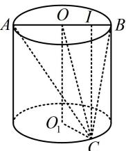

> [!faq]- 《第1节 动态问题探究》参考答案
>
> > [!success]- **【答案】** $[2, \sqrt{5}]$
>
> > [!note]- **【分析】**
> > 本题未单列分析。
>
> > [!note]- **【解析】**
> > 解析：由于 $AB$ 的长不变，所以分析 $S_{\triangle ABC}$ 的取值范围时，以 $AB$ 为底，研究高的范围即可，
> >
> > 如图，作 $CI \perp AB$ 于 $I$ ，由题意， $OO_{1} = 2$ ， $O_{1}C = 1$
> >
> > 所以 $OC = \sqrt{OO_{1}^{2} + O_{1}C^{2}} = \sqrt{5}$ ,
> >
> > 因为 $IC = \sqrt{OC^2 - OI^2} = \sqrt{5 - OI^2}$ ，且 $0\leq OI\leq 1$
> >
> > 所以 $2 \leq IC \leq \sqrt{5}$
> >
> > 又 $S_{\triangle ABC} = \frac{1}{2} AB\cdot IC = \frac{1}{2}\times 2IC = IC$ ，所以 $2\leq S_{\triangle ABC}\leq \sqrt{5}$
> >
> > 
