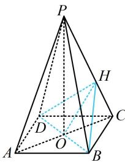

> [!faq]- 《第1节 动态问题探究》参考答案
>
> > [!success]- **【答案】** D
>
> > [!note]- **【分析】**
> > 本题未单列分析。
>
> > [!note]- **【解析】**
> > D
> >
> > 解析：如图， $PO \perp$ 平面 $ABCD \Rightarrow PO \perp BD$ ，
> >
> > 又 $BD \perp AC$ ，所以 $BD \perp$ 平面 $PAC$ ，故 $BD \perp OH$
> >
> > 由于 $BD$ 的长不变，所以当 $OH$ 最小时 $S_{\triangle HBD}$ 最小，此时 $OH \perp PC$ ，算直角三角形斜边上的高，可用等面积法，由题意， $OP = 4$ ， $OC = \frac{1}{2} AC = \frac{1}{2} \times 2\sqrt{2} = \sqrt{2}$ ，
> >
> > $PC = \sqrt{OP^2 + OC^2} = 3\sqrt{2}$ ，所以 $S_{\triangle POC} = \frac{1}{2} PC\cdot OH$
> >
> > $= \frac{1}{2} OP\cdot OC$ ，故 $OH = \frac{OP\cdot OC}{PC} = \frac{4}{3}$
> >
> > 所以 $(S_{\triangle HBD})_{\mathrm{min}} = \frac{1}{2}\times 2\sqrt{2}\times \frac{4}{3} = \frac{4\sqrt{2}}{3}.$
> >
> > 
>
> > [!tip]- **【反思】**
> > 分析三角形面积的最值, 常抓住不变的特征. 例如第 1 题的底边 $AB$ , 第 2 题的底边 $BD$ , 故只需分析它们高的最值. 本类型一般不难, 故方法册没单独讲.
