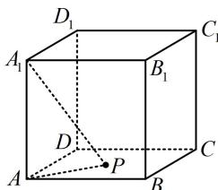
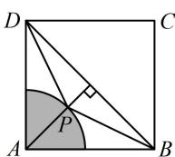

> [!faq]- 《第1节 动态问题探究》参考答案
>
> > [!success]- **【答案】** C
>
> > [!note]- **【分析】**
> > 本题未单列分析。
>
> > [!note]- **【解析】**
> > (2023·云南昆明模拟·★★★☆)
> >
> > 正方体 $ABCD - A_{1}B_{1}C_{1}D_{1}$ 的棱长为 3，点 $P$ 在正方形 $ABCD$ 的边界及其内部运动，若 $3 \leq A_{1}P \leq \sqrt{11}$ ，则三棱锥 $P - A_{1}BD$ 的体积的最小值是（）A. 1 B. $\frac{3}{2}$ C. 3 D. $\frac{9}{2}$
> >
> > 解析：条件中有 $A_{1}P$ 的范围， $A_{1}$ 为定点，故分析点 $P$ 的轨迹，如图1，由于点 $P$ 在正方形ABCD内，所以把 $A_{1}P$ 向平面ABCD投影，到平面ABCD上来分析，因为 $AA_{1} \perp$ 平面ABCD，所以 $AA_{1} \perp AP$ ，故 $A_{1}P = \sqrt{AA_{1}^{2} + AP^{2}} = \sqrt{9 + AP^{2}}$ ，所以 $3 \leq A_{1}P \leq \sqrt{11} \Rightarrow 3 \leq \sqrt{9 + AP^{2}} \leq \sqrt{11} \Rightarrow 0 \leq AP \leq \sqrt{2}$ ，所以点 $P$ 的轨迹是正方形ABCD内的以 $A$ 为圆心， $\sqrt{2}$ 为半径的圆内（含边界），如图2，由图1可知， $V_{P - A_1BD} = V_{A_1 - PBD} = \frac{1}{3} S_{\triangle PBD} \cdot AA_1 = S_{\triangle PBD}$ ，所以问题等价于求 $\triangle PBD$ 的面积的最小值，当 $P$ 在如图2所示的位置时， $\triangle PBD$ 的 $BD$ 边上的高最小，而 $BD = 3\sqrt{2}$ 不变，所以此时 $S_{\triangle PBD}$ 最小，故 $(V_{P - A_1BD})_{\min} = (S_{\triangle PBD})_{\min} = \frac{1}{2} \times 3\sqrt{2} \times \left(\frac{3\sqrt{2}}{2} - \sqrt{2}\right) = \frac{3}{2}$ .
> >
> >   
> > 图1
> >
> >   
> > 图2
