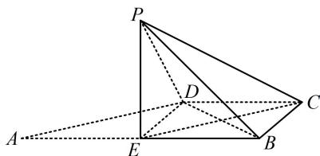

> [!faq]- 《第1节 动态问题探究》参考答案
>
> > [!success]- **【答案】** AB
>
> > [!note]- **【分析】**
> > 本题未单列分析。
>
> > [!note]- **【解析】**
> > AB
> >
> > 解析：A项，要分析面面垂直，先找线面垂直，观察图形可猜想 $CD \perp$ 面PED，故尝试找理由，如图，由题设可分析出BCDE是边长为1的正方形，连接 $EC$ ，则 $PE = 1$ ， $EC = \sqrt{2}$ ，翻折后 $PC = \sqrt{3}$ 所以 $PE^2 + EC^2 = PC^2$ ，故 $PE \perp EC$ ①，因为翻折前 $AE \perp ED$ ，所以翻折后 $PE \perp ED$ 结合①可得 $PE \perp$ 平面BCDE，所以 $PE \perp CD$ 又因为 $CD \perp DE$ ，所以 $CD \perp$ 平面PED，从而平面PED⊥平面PCD，故A项正确；
> >
> > B项， $PC$ 在平面BCDE内的射影好找，故用三垂线定理判断， $PE\bot$ 平面 $BCDE\Rightarrow PC$ 在该面内的射影为 $EC$ 因为 $BD\bot EC$ ，所以 $BD\bot PC$ ，故B项正确；  
> > C项，前面已证 $CD\bot$ 面PED，所以 $CD\bot PD$ 又 $CD\bot DE$ ，所以 $\angle PDE$ 是二面角 $P - DC - B$ 的平面角， $\tan \angle PDE = \frac{PE}{DE} = 1\Rightarrow \angle PDE = 45^{\circ}$ ，故C项错误；
> >
> > D 项，因为 $CD \perp$ 平面 $PED$ ，所以 $\angle CPD$ 即为 $PC$ 与平面 $PED$ 所成角， $CD = 1$ ，又 $PD = AD = \sqrt{2}$ ，所以 $\tan \angle CPD = \frac{CD}{PD} = \frac{\sqrt{2}}{2}$ ，从而 $\angle CPD \neq 45^{\circ}$ ，故 D 项错误.
> >
> > 
