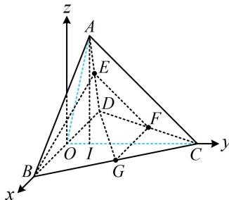

> [!faq]- 《第1节 动态问题探究》参考答案
>
> > [!success]- **【答案】** ABD
>
> > [!note]- **【分析】**
> > 本题未单列分析。
>
> > [!note]- **【解析】**
> > 解析：A项，如图，折起后的三棱锥中，E，F仍为AD，CD的中点，所以EF//AC，从而EF//平面ABC，故A项正确；
> > B项，如图，直线BE与DG是异面直线，故B项正确，
> > C项，判断垂直可用数量积，C、D选项都容易通过坐标翻译，不妨直接建系。可将翻折角A-BD-C设为变量，表示各点，
> > 取BD中点O，则OC⊥BD，OA⊥BD，所以BD⊥平面AOC，以O为原点建立如图所示的空间直角坐标系，
> > 设二面角A-BD-C的大小为θ，则∠AOC=θ(0<θ<π)，不妨设BD=4，由题意，△ABD和△BCD都是边长为4的正三角形，所以OA=OC=2√3，故B(2,0,0)，D(-2,0,0)，C(0,2√3,0)，G(1,√3,0)，还要写出点E的坐标，E为AD中点，所以先写点A的坐标，需找到A在面BCD内的射影，不妨先看∠AOC为锐角的情形，
> > 当∠AOC为锐角时，如图，作AI⊥OC于点I，
> > 由BD⊥平面AOC可知AI⊥BD，所以AI⊥平面BCD，
> > 且OI=OA·cos∠AOC=2√3cosθ，AI=OA·sin∠AOC
> > =2√3sinθ，故A(0,2√3cosθ,2√3sinθ),
> > 图中所画的θ为锐角，但可以想象，即使θ为钝角或直角，点A的坐标仍为上述结果，
> > 因为E为AD的中点，所以E(-1,√3cosθ,√3sinθ)，
> > 从而 $\overrightarrow{BE}=(-3,\sqrt{3}\cos\theta,\sqrt{3}\sin\theta)$ ， $\overrightarrow{DG}=(3,\sqrt{3},0)$ ，
> > 故 $\overrightarrow{BE}\cdot\overrightarrow{DG}=-3\times3+\sqrt{3}\cos\theta\times\sqrt{3}+\sqrt{3}\sin\theta\times0=3\cos\theta-9$ ≠0，所以BE与DG不可能垂直，故C项错误；
> > D项，若 $EG=\frac{\sqrt{7}}{4}AB$ ，则 $\sqrt{(-1-1)^{2}+(\sqrt{3}\cos\theta-\sqrt{3})^{2}+(\sqrt{3}\sin\theta-0)^{2}}=\frac{\sqrt{7}}{4}\times4$ 化简得： $2\cos\theta-1=0$ ，所以 $\cos\theta=\frac{1}{2}$ 结合 $0<\theta<\pi$ 可得 $\theta=\frac{\pi}{3}$ ，故D项正确.
> >
> > 
