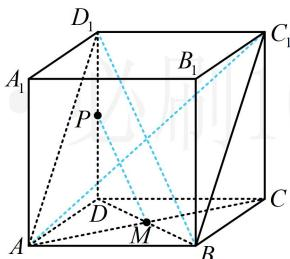
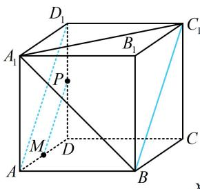
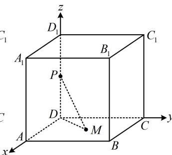

> [!faq]- 《第1节 动态问题探究》参考答案
>
> > [!success]- **【答案】** BCD
>
> > [!note]- **【分析】**
> > 本题未单列分析。
>
> > [!note]- **【解析】**
> > BCD
> >
> > 解析：A项，如图1，当 $M$ 为 $AC$ 中点时，结合 $P$ 为 $DD_{1}$ 中点可得 $PM \parallel BD_{1}$ ，由正方体的结构特征可知 $AB \neq BC_{1}$ ，所以四边形 $ABC_{1}D_{1}$ 不是菱形，从而 $BD_{1}$ 与 $AC_{1}$ 不垂直，故 $PM$ 与 $AC_{1}$ 也不垂直，故A项错误；
> >
> >   
> > 图1
> >
> > B项，如图2，当 $M$ 为 $AD$ 中点时， $PM \parallel AD_{1}$
> >
> > 因为 $AD_{1} \parallel BC_{1}$ ，所以 $PM \parallel BC_{1}$ ，
> >
> > 由图2可知 $BC_{1}\subset$ 平面 $A_{1}BC_{1}$ ， $PM\not\subset$ 平面 $A_{1}BC_{1}$
> >
> > 所以 $PM \parallel$ 平面 $A_{1}BC_{1}$ ，故B项正确；
> >
> > C项，由于点 $M$ 在面ABCD内，故考虑把条件 $2PM =$
> >
> > $\sqrt{3}DD_{1}$ 中的 PM 转化到面 ABCD 内来考虑,
> >
> > 不妨设正方体棱长为2，因为 $2PM=\sqrt{3}DD_{1}$ ，
> >
> > 所以 $PM = \frac{\sqrt{3}}{2} DD_{1} = \sqrt{3}$ ，又 $DD_{1}\perp$ 平面ABCD，
> >
> > 所以 $PD \perp DM$ ，故 $DM = \sqrt{PM^2 - PD^2} = \sqrt{(\sqrt{3})^2 - 1^2} = \sqrt{2}$
> >
> > 为定值，所以 $M$ 在面ABCD内以 $D$ 为圆心， $\sqrt{2}$ 为半径的圆上，故C项正确；
> >
> > D 项，直线 $PM$ 与 $AD$ 所成的角用几何方法分析略显麻烦，正方体中可直接建系，用夹角余弦公式处理角度更方便，如图3建系，则 $A(2,0,0)$ ， $D(0,0,0)$ ，
> >
> > 因为 P 为 $DD_{1}$ 的中点，所以 $P(0,0,1)$ ，设 $M(x,y,0)$ ，
> >
> > $\overrightarrow{PM} = (x,y, - 1)$ ， $\overrightarrow{AD} = (-2,0,0)$
> >
> > 由题意， $\left|\cos<\overrightarrow{PM},\overrightarrow{AD}>\right|=\frac{\left|\overrightarrow{PM}\cdot\overrightarrow{AD}\right|}{\left|\overrightarrow{PM}\right|\cdot\left|\overrightarrow{AD}\right|}=\frac{\left|-2x\right|}{\sqrt{x^{2}+y^{2}+1}\times2}$
> >
> > $= \cos 30^{\circ} = \frac{\sqrt{3}}{2}$ ，化简得： $\frac{x^2}{3} -y^2 = 1$
> >
> > 这是双曲线的方程，所以点 M 在双曲线上，故 D 项正确.
> >
> >   
> > 图2
> >
> >   
> > 图3
