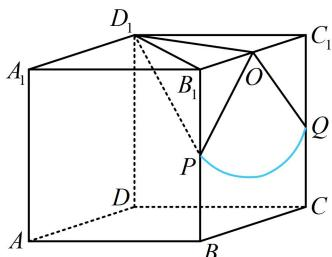

> [!faq]- 《第1节 动态问题探究》参考答案
>
> > [!success]- **【答案】** $\frac{\sqrt{2}\pi}{2}$
>
> > [!note]- **【分析】**
> > 本题未单列分析。
>
> > [!note]- **【解析】**
> > 解析：研究球面与侧面 $BCC_{1}B_{1}$ 的交线属球的截面问题，故过球心作截面的垂线，找到截面圆圆心，
> >
> > 取 $B_{1}C_{1}$ 的中点 $O$ ，连接 $OD_{1}$ ，由题设可知 $\triangle B_1C_1D_1$ 是正三角形，所以 $OD_{1}\perp B_{1}C_{1}$
> >
> > 又 $ABCD - A_{1}B_{1}C_{1}D_{1}$ 是直四棱柱，所以 $BB_{1}\perp$ 面 $A_{1}B_{1}C_{1}D_{1}$
> >
> > 从而 $OD_{1} \perp BB_{1}$ ，故 $OD_{1} \perp$ 面 $BB_{1}C_{1}C$
> >
> > 所以点 $O$ 就是截面圆的圆心，且 $OD_{1} = \sqrt{3}$
> >
> > 故球心到截面的距离为 $\sqrt{3}$ ，因为球的半径 $R = \sqrt{5}$
> >
> > 所以截面圆半径 $r=\sqrt{R^{2}-OD_{1}^{2}}=\sqrt{2}$
> >
> > 到此问题就转化成在正方形 $BB \mid C \mid C$ 内，以 $O$ 为圆心， $\sqrt{2}$ 为半径作圆弧，求该圆弧弧长的问题，
> >
> > 设该圆与 $BB_{1}$ 和 $CC_{1}$ 分别交于 $P$ ， $Q$ 两点，
> >
> > 因为 $OB_{1} = 1$ ， $OP = \sqrt{2}$ ，所以 $B_{1}P = 1$ ， $\angle POB_{1} = 45^{\circ}$
> >
> > 由对称性可知 $\angle QOC_{1} = 45^{\circ}$ ，所以 $\angle POQ = 90^{\circ}$
> >
> > 故该球面与侧面 $BCC_{1}B_{1}$ 的交线长为 $\frac{1}{4} \times 2\pi \times \sqrt{2} = \frac{\sqrt{2}\pi}{2}$ .
> >
> > 
