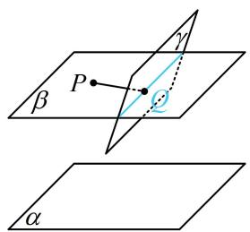
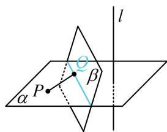

<!-- source-part:1 pages:1-8 -->

# 模块四 综合提升篇

# 第1节 动态问题探究（★★★☆）

## 内容提要

动点、动线、动面问题是立体几何小题中的难点问题，本节归纳几种常见的动态问题的解题方法.

1. 动态平行、垂直的判断:

①过定点 $P$ 和动点 $Q$ 的直线 $PQ \parallel$ 平面 $\alpha$ , 要找 $Q$ 的轨迹, 可过 $P$ 作与 $\alpha$ 平行的平面 $\beta$ , 则点 $Q$ 在 $\beta$ 上. 若规定 $Q$ 也在另一平面 $\gamma$ 上, 则 $Q$ 的轨迹是 $\beta$ 与 $\gamma$ 的交线, 如图1中的蓝线.

②过定点 $P$ 和动点 $Q$ 的直线 $PQ \perp$ 定直线 $l$ , 要找 $Q$ 的轨迹, 可过 $P$ 作与 $l$ 垂直的平面 $\alpha$ , 则 $Q$ 在 $\alpha$ 上, 若规定 $Q$ 也在另一个平面 $\beta$ 上, 则 $Q$ 的轨迹是 $\alpha$ 与 $\beta$ 的交线, 如图2中的蓝线.

  
图1

  
图2

2. 空间轨迹为球:

①空间中满足到定点 $P$ 的距离等于定长 $R$ 的点 $A$ 的轨迹是以 $P$ 为球心， $R$ 为半径的球面；

②设 $P$ ， $Q$ 为空间两定点，点 $A$ 满足 $AP \perp AQ$ ，则点 $A$ 的轨迹是以 $PQ$ 为直径的球面.

若在上述情况的基础上，增加限制动点 $A$ 在某平面上，则点 $A$ 只能在球的截面圆上运动.

3. 直线上的动点问题: 例如, $P$ 为定直线 $AB$ 上的动点, 这类问题除了几何法分析之外, 还可考虑建系, 借助 $\overrightarrow{AP} = \lambda \overrightarrow{AB}$ 将动点 $P$ 的坐标表示成 $\lambda$ , 用向量法分析问题.

4. 翻折问题：解决翻折问题的核心有两点.

①分析翻折前后未发生变化的几何关系，得出翻折后空间图形的几何特征，将问题明朗化.

②在翻折前后的图形中，抓住与折痕线垂直的直线，将空间的计算问题转换到平面上来进行.

![[高中/总复习/教辅/一数常规版2026/第9章 立体几何、空间向量/模块4 综合提升篇/第1节 动态问题探究/类型01_通过位置关系判断轨迹的基本方法/类型01_通过位置关系判断轨迹的基本方法.md]]
![[高中/总复习/教辅/一数常规版2026/第9章 立体几何、空间向量/模块4 综合提升篇/第1节 动态问题探究/类型02_空间轨迹由球到圆/类型02_空间轨迹由球到圆.md]]
![[高中/总复习/教辅/一数常规版2026/第9章 立体几何、空间向量/模块4 综合提升篇/第1节 动态问题探究/类型03_翻折问题/类型03_翻折问题.md]]
![[高中/总复习/教辅/一数常规版2026/第9章 立体几何、空间向量/模块4 综合提升篇/第1节 动态问题探究/类型04_直线上的动点问题处理思路/类型04_直线上的动点问题处理思路.md]]
![[高中/总复习/教辅/一数常规版2026/第9章 立体几何、空间向量/模块4 综合提升篇/第1节 动态问题探究/强化训练/强化训练.md]]
