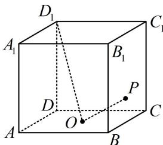

<!-- question-source:start -->
【例2】如图, 正方体 $ABCD-A_{1}B_{1}C_{1}D_{1}$ 的棱长为 2 , 点 $O$ 为底面 $ABCD$ 的中心, 点 $P$ 在侧面 $BCC_{1}B_{1}$ 的边界及其内部运动, 若 $D_{1}O \perp OP$ , 则 $\triangle D_{1}C_{1}P$ 的面积的最大值为 ( )

A. $\frac{2 \sqrt{5}}{5}$ B. $\frac{4 \sqrt{5}}{5}$ C. $\sqrt{5}$ D. $2 \sqrt{5}$

<!-- question-source:end -->

![[高中/总复习/教辅/一数常规版2026/第9章 立体几何、空间向量/模块4 综合提升篇/第1节 动态问题探究/类型01_通过位置关系判断轨迹的基本方法/例题/answers/Q00050626A1.md]]
