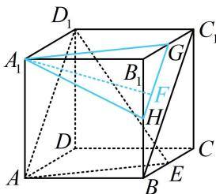

> [!faq]- 《第1节 动态问题探究》例题解析
>
> > [!success]- **【答案】** B
>
> > [!note]- **【分析】**
> > 本题未单列分析。
>
> > [!note]- **【解析】**
> > 解析：由 $A_{1}F$ //面 $AD_{1}E$ 找 $F$ 的轨迹，可过 $A_{1}$ 作与面 $AD_{1}E$ 平行的面，找该面与面 $BB_{1}C_{1}C$ 的交线，如图，取 $B_{1}C_{1}$ 中点 $G$ ，连接 $A_{1}G$ ，则 $A_{1}G \parallel AE$ 取 $BB_{1}$ 中点 $H$ ，连接 $GH$ ， $A_{1}H$ ，则 $GH \parallel BC_{1} \parallel AD_{1}$ 所以面 $A_{1}GH \parallel$ 面 $AD_{1}E$ ，因为面 $A_{1}GH \cap$ 面 $BB_{1}C_{1}C = GH$ 所以点 $F$ 的轨迹为线段 $GH$ ，其长度为 $\sqrt{2}$ 答案：B
> >
> > 
