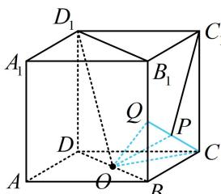
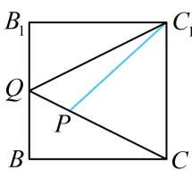

> [!faq]- 《第1节 动态问题探究》例题解析
>
> > [!success]- **【答案】** C
>
> > [!note]- **【分析】**
> > 本题未单列分析。
>
> > [!note]- **【解析】**
> > 解析：要求 $S_{\triangle D_1C_1P}$ 的最大值，需先由 $D_1O \perp OP$ 分析 $P$ 的轨迹，可过 $O$ 作与 $D_1O$ 垂直的平面来看，于是又只需过 $O$ 作两条与 $D_1O$ 垂直的直线，如图1，由正方体的结构特征， $\left\{ \begin{array}{l} CO \perp BD \\ CO \perp BB_1 \end{array} \right. \Rightarrow CO \perp$ 平面 $BB_1D_1D \Rightarrow CO \perp D_1O$ ①，有一条了，另一条不妨在 $D_1O$ 所在的面 $BB_1D_1D$ 内来作，在面 $BB_1D_1D$ 内作 $OQ \perp D_1O$ 交 $BB_1$ 于 $Q$ ，连接 $CQ$ ，则 $\triangle D_1DO \sim \triangle OBQ$ ，所以 $\frac{BQ}{OD} = \frac{OB}{DD_1} = \frac{\sqrt{2}}{2}$ ，从而 $BQ = \frac{\sqrt{2}}{2}OD = 1$ ，故 $Q$ 为 $BB_1$ 中点，由 $OQ \perp D_1O$ 和①可得 $D_1O \perp$ 面 $COQ$ ，所以当 $P$ 在面 $COQ$ 内时，总有 $OP \perp D_1O$ ，又 $P$ 在侧面 $BCC_1B_1$ 内，所以 $P$ 的轨迹是线段 $CQ$ ，
> >
> > 现在就能分析 $S_{\triangle D_1C_1P}$ 何时最大了，由图1可知 $D_{1}C_{1}\bot C_{1}P$ 所以 $C_1P$ 最大时， $S_{\triangle D_1C_1P}$ 就最大，如图2，当 $P$ 与 $Q$ 重合时， $C_1P$ 最大，所以 $(S_{\triangle D_1C_1P})_{\mathrm{max}} = \frac{1}{2} D_1C_1\cdot C_1Q = \sqrt{5}.$ 答案：C
> >
> >   
> > 图1
> >
> >   
> > 图2
