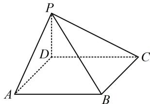

<!-- question-source:start -->
【变式】如图，四棱锥 P-ABCD 中，底面 ABCD 是边长为 4 的正方形， $\angle PBA = \angle PBC$ ， $PD \perp AD$ ，Q 为正方形 ABCD 内一动点，且满足 $QA \perp QP$ ，若 PD = 2，则三棱锥 Q-PBC 的体积的最小值为（）

A. 3 B. $\frac{8}{3}$ C. $\frac{4}{3}$ D. 2

<!-- question-source:end -->

![[高中/总复习/教辅/一数常规版2026/第9章 立体几何、空间向量/模块4 综合提升篇/第1节 动态问题探究/类型02_空间轨迹由球到圆/例题/answers/Q00050628A1.md]]
