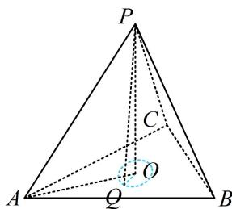

> [!faq]- 《第1节 动态问题探究》例题解析
>
> > [!success]- **【答案】** B
>
> > [!note]- **【分析】**
> > 本题未单列分析。
>
> > [!note]- **【解析】**
> > 解析：$Q$ 在 $\triangle ABC$ 内，故考虑把 $PQ \leq 5$ 转换成 $Q$ 与面 $ABC$ 内某点的关系，由正棱锥想到选底面中心，如图，设 $O$ 为 $\triangle ABC$ 的中心，则 $PO \perp$ 平面 $ABC$ ，当 $Q$ 在 $\triangle ABC$ 内部运动时，总有 $OQ \perp PO$ ，所以 $PQ = \sqrt{PO^2 + OQ^2}$ ，故 $PQ \leq 5$ 即为 $\sqrt{PO^2 + OQ^2} \leq 5$ ①，又 $AO = 6 \times \frac{\sqrt{3}}{2} \times \frac{2}{3} = 2\sqrt{3}$ ，所以 $PO = \sqrt{PA^2 - AO^2} = 2\sqrt{6}$ ，代入①得： $OQ \leq 1$ ，所以集合 $T$ 表示的区域是 $\triangle ABC$ 内以 $O$ 为圆心，1为半径的圆及其内部，
> >
> > 故 T 表示的区域的面积 $S = \pi \times 1^{2} = \pi$ .
> >
> >
> > 
>
> > [!tip]- **【反思】**
> > 空间中到某定点距离为定值的点的轨迹是球面，若该点还在空间的某个平面上，则轨迹就是圆.
