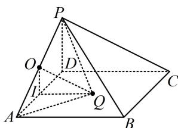
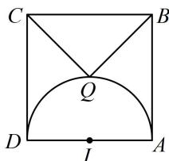

> [!faq]- 《第1节 动态问题探究》例题解析
>
> > [!success]- **【答案】** B
>
> > [!note]- **【分析】**
> > 本题未单列分析。
>
> > [!note]- **【解析】**
> > 解析：从图形结合 $PD \perp AD$ 可猜想 $PD \perp$ 平面 $ABCD$ ，先对此分析，再找一条垂直于 $PD$ 的线即可，因为 $ABCD$ 是正方形，所以 $AB = BC$ ，又 $\angle PBA = \angle PBC$ ， $PB = PB$ ，所以 $\triangle PAB \cong \triangle PCB$ ，故 $PA = PC$ ，又 $AD = CD$ ， $PD = PD$ ，所以 $\triangle PAD \cong \triangle PCD$ ，结合 $PD \perp AD$ 可得 $PD \perp CD$ ，所以 $PD \perp$ 平面 $ABCD$ ，再来翻译 $QA \perp QP$ ，类比圆上，我们有球的直径所对的“球周角”为直角，由 $QA \perp QP$ 可知点 $Q$ 在以 $PA$ 为直径的球面上，其球心为 $PA$ 中点 $O$ ，且 $OQ = \frac{1}{2} PA = \sqrt{5}$ ，
> >
> > 但点 $Q$ 只能在正方形 $ABCD$ 内, 故应考虑面 $ABCD$ 与球面相交的截面圆. 涉及球的截面, 过球心作截面的垂线, 可找到截面圆圆心, 故只需过 $O$ 作面 $ABCD$ 的垂线,取 $AD$ 中点 $I$ , 连接 $OI$ , 则 $OI = \frac{1}{2}PD = 1$ 且 $OI \parallel PD$ , 所以 $OI \perp$ 平面 $ABCD$ , 故 $I$ 即为截面圆圆心,且 $IQ = \sqrt{OQ^2 - OI^2} = 2$ , 所以点 $Q$ 在以 $I$ 为圆心, 2 为半径的圆上, 把底面单独画出来如图 2,
> >
> > 因为 $V_{Q - PBC} = V_{P - QBC}$ ，而点 $P$ 到平面 $QBC$ 的距离恒为2，故要使三棱锥 $P - QBC$ 的体积最小，只需 $S_{\triangle QBC}$ 最小，此时点 $Q$ 应为圆弧中点，故 $(V_{Q - PBC})_{\mathrm{min}} = \frac{1}{3}\times \frac{1}{2}\times 4\times 2\times 2 = \frac{8}{3}.$ 答案：B
> >
> >   
> > 图1
> >
> >   
> > 图2
