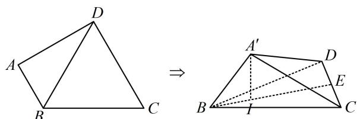

<!-- question-source:start -->
【例 4】如图，平面四边形 ABCD 中， $\triangle BCD$ 是边长为 2 的正三角形， $AB \perp AD$ ，AB = 1，现沿对角线 BD 将 $\triangle ABD$ 折起到 $\triangle A'BD$ ，使 $A'$ 在平面 BCD 内的射影 I 落在 $\triangle BCD$ 的中线 BE 上，则 BI = \_\_\_\_.

<!-- question-source:end -->

![[高中/总复习/教辅/一数常规版2026/第9章 立体几何、空间向量/模块4 综合提升篇/第1节 动态问题探究/类型03_翻折问题/例题/answers/Q00050629A1.md]]
