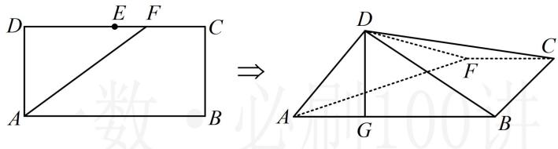

<!-- question-source:start -->
【变式】如图，矩形 ABCD 中，AB = 4， $AD = \sqrt{3}$ ，E 为 CD 中点，F 为线段 EC 上（端点除外）一动点，现将 $\triangle AFD$ 沿 AF 折起，使平面 $ABD \perp$ 平面 ABC，在平面 ABD 内过点 D 作 $DG \perp AB$ 于 G，则 AG 长度的取值范围为 \_\_\_\_.

<!-- question-source:end -->

![[高中/总复习/教辅/一数常规版2026/第9章 立体几何、空间向量/模块4 综合提升篇/第1节 动态问题探究/类型03_翻折问题/例题/answers/Q00050630A1.md]]
