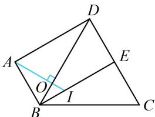
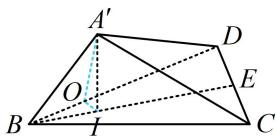

> [!faq]- 《第1节 动态问题探究》例题解析
>
> > [!success]- **【答案】** $\frac{\sqrt{3}}{3}$
>
> > [!note]- **【分析】**
> > 本题未单列分析。
>
> > [!note]- **【解析】**
> > 解析：若直接在 $\triangle A^{\prime} B I$ 中用勾股定理求 $B I$ , 会发现 $A^{\prime} I$ 不好算, 但若将翻折后空间图形中的 $I$ 对应到翻折前的平面图形中去, 算 $B I$ 就成了初中问题,
> >
> > 如图2，作 $A'O \perp BD$ 于 $O$ ， $A'I \perp$ 平面 $BCD \Rightarrow BD \perp A'I$ ，所以 $BD \perp$ 平面 $A'OI$ ，故 $BD \perp OI$
> >
> > 注意到翻折前后 $\triangle BCD$ 和 $\triangle A^{\prime}BD$ 内部点线的位置关系未变，故翻折前也有 $BD \perp AO$ ， $BD \perp OI$ ，于是 $I, O$ 在原图中的位置如图1，接下来的计算可在图1中进行，
> >
> > $$
> > A B = 1 \Rightarrow O B = A B \cdot \cos \angle A B O = A B \cdot \frac {A B}{B D} = \frac {1}{2}
> > $$
> >
> > 由题意， $\angle OBI = 30^{\circ}$ ，所以 $BI = \frac{OB}{\cos\angle OBI} = \frac{\sqrt{3}}{3}$
> >
> > 
> >
> > 
> >
> >
> > 图1
> >
> > 图2
>
> > [!tip]- **【反思】**
> > 求解翻折问题的核心有两点：①分析翻折前后未发生变化的几何关系（如本题的 $\triangle ABD$ 和 $\triangle BCD$ 及其内部的线不随折叠而改变）；
> > - **②**：抓住与折痕线垂直的直线（如本题的 $AI \perp BD$ ），将空间的计算问题转换到平面上来处理.
