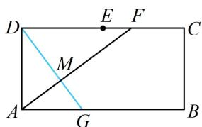
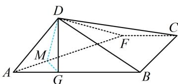

> [!faq]- 《第1节 动态问题探究》例题解析
>
> > [!success]- **【答案】** $\left(\frac{3}{4},\frac{3}{2}\right)$
>
> > [!note]- **【分析】**
> > 本题未单列分析。
>
> > [!note]- **【解析】**
> > 解析：先把翻折后空间图形的点 $G$ 对应到翻折前的平面图形中去，再分析 $AG$ 怎么算，
> >
> > 由题意，平面 $ABD \perp$ 平面 $ABC$ ，且 $DG \perp AB$ ，所以 $DG \perp$ 平面 $ABC$ ，故 $AF \perp DG$ ，
> >
> > 如图2，作 $DM \perp AF$ 于 $M$ ，连接 $GM$ ，结合 $AF \perp DG$ 可得 $AF \perp$ 平面 $DGM$ ，所以 $AF \perp MG$ ，注意到翻折前后 $\triangle ADF$ 和梯形 $ABCF$ 内部的点线位置关系未变，故翻折前也应有 $AF \perp DM$ ， $AF \perp GM$ ，于是 $G$ ， $M$ 在原图中的位置如图1，要求 $AG$ 的范围，可设 $DF$ 为变量，表示 $AG$
> >
> > 设 $DF = x(2 < x < 4)$ ，因为 $\triangle AGM \sim \triangle FDM$ ，所以 $\frac{AG}{DF} = \frac{AM}{FM}$ ①，
> >
> > 由图可知， $AF = \sqrt{AD^2 + DF^2} = \sqrt{3 + x^2}$ ， $AM = AD\cdot \cos \angle DAF = AD\cdot \frac{AD}{AF} = \frac{3}{\sqrt{3 + x^2}}$
> >
> > $$
> > F M = D F \cdot \cos \angle D F A = D F \cdot \frac {D F}{A F} = \frac {x ^ {2}}{\sqrt {3 + x ^ {2}}}
> > $$
> >
> > 结合①可得 $AG = \frac{DF\cdot AM}{FM} = \frac{3}{x}$
> >
> > 因为 $2 < x < 4$ ，所以 $\frac{3}{4} < AG < \frac{3}{2}$
> >
> >
> > 
> >
> >   
> > 图1  
> > 图2
