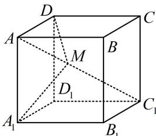
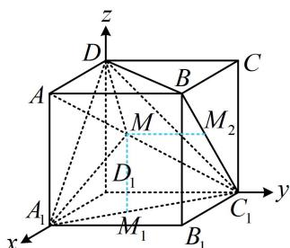
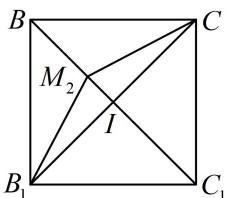
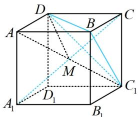
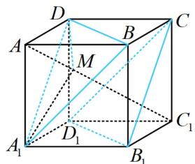
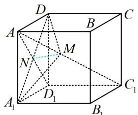
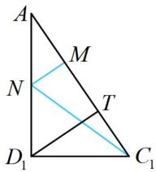

> [!faq]- 《第1节 动态问题探究》例题解析
>
> > [!success]- **【答案】** ABD
>
> > [!note]- **【分析】**
> > 本题未单列分析。
>
> > [!note]- **【解析】**
> > A. 存在点 $M$ ，使 $A_{1}M \perp$ 平面 $BC_{1}D$ B. 存在点 $M$ ，使 $DM \parallel$ 平面 $B_{1}CD_{1}$ C. $\triangle A_{1}DM$ 的面积不可能等于 $\frac{\sqrt{3}}{6}$ D. 若 $S_{1}$ ， $S_{2}$ 分别是 $\triangle A_{1}DM$ 在面 $A_{1}D$
> >
> > $$
> > A _ {1} B _ {1} C _ {1} D _ {1}
> > $$
> >
> > 
> >
> > $$
> > B B _ {1} C _ {1} C
> > $$
> >
> > $$
> > S _ {1} = S _ {2}
> > $$
> >
> > 解法1：点 $M$ 是唯一动点，且在线段 $AC_{1}$ 上，故可建系，设出 $M$ 的坐标，用向量法判断选项，如图1建系，设 $\overrightarrow{AM} = \lambda \overrightarrow{AC_1}(0 < \lambda < 1)$ ， $D_{1}(0,0,0)$ ， $A(1,0,1)$ ， $C_{1}(0,1,0)$ ，所以 $\overrightarrow{AC_1} = (-1,1,-1)$ ，故 $\overrightarrow{D_1M} = \overrightarrow{D_1A} + \overrightarrow{AM} = \overrightarrow{D_1A} + \lambda \overrightarrow{AC_1} = (1,0,1) + (-\lambda, \lambda, -\lambda) = (1-\lambda, \lambda, 1-\lambda)$ ，所以 $M(1-\lambda, \lambda, 1-\lambda)$ ，A项，判断线面垂直，只需看 $A_{1}M$ 能否与面 $BC_{1}D$ 内的两条相交直线垂直（无需求法向量）， $A_{1}(1,0,0)$ ， $B(1,1,1)$ ， $D(0,0,1)$ ，所以 $\overrightarrow{A_1M} = (-\lambda, \lambda, 1-\lambda)$ ， $\overrightarrow{DB} = (1,1,0)$ ， $\overrightarrow{C_1B} = (1,0,1)$ ，令 $\left\{ \begin{array}{l} \overrightarrow{A_1M} \cdot \overrightarrow{DB} = -\lambda + \lambda = 0 \\ \overrightarrow{A_1M} \cdot \overrightarrow{C_1B} = -\lambda + 1 - \lambda = 0 \end{array} \right.$ 可得 $\lambda = \frac{1}{2}$ ，所以当 $M$ 为 $AC_{1}$ 中点时， $A_{1}M \perp$ 面 $BC_{1}D$ ，故 A 项正确；B项，要判断线面能否平行，只需看直线的方向向量与平面的法向量能否垂直，可求得平面 $B_{1}CD_{1}$ 的一个法向量为 $n = (-1,1,-1)$ ， $\overrightarrow{DM} = (1-\lambda, \lambda, -\lambda)$ ，令 $\overrightarrow{DM} \cdot n = \lambda - 1 + \lambda + \lambda = 0$ 可得 $\lambda = \frac{1}{3}$ ，所以存在点 $M$ ，使 $DM //$ 平面 $B_{1}CD_{1}$ ，故 B 项正确；C项，要求 $\triangle A_{1}DM$ 的面积，关键是求点 $M$ 到直线 $A_{1}D$ 的距离，可用向量法来求，因为 $\overrightarrow{A_1D} = (-1,0,1)$ ，所以直线 $A_{1}D$ 的一个单位方向向量为 $u = \frac{\overrightarrow{A_1D}}{\left|\overrightarrow{A_1D}\right|} = \left(-\frac{\sqrt{2}}{2}, 0, \frac{\sqrt{2}}{2}\right)$ ，又 $\overrightarrow{A_1M} = (-\lambda, \lambda, 1-\lambda)$ ，所以点 $M$ 到直线 $A_{1}D$ 的距离 $d = \sqrt{\overrightarrow{A_1M^2} - (\overrightarrow{A_1M} \cdot u)^2} = \sqrt{3\lambda^2 - 2\lambda + \frac{1}{2}}$ ，因为 $A_{1}D = \sqrt{2}$ ，所以 $S_{\triangle A_1DM} = \frac{1}{2} \times \sqrt{2} \times \sqrt{3\lambda^2 - 2\lambda + \frac{1}{2}}$ ，令 $S_{\triangle A_1DM} = \frac{\sqrt{3}}{6}$ 解得： $\lambda = \frac{1}{3}$ ，所以 $\triangle A_{1}DM$ 的面积可以等于 $\frac{\sqrt{3}}{6}$ ，故 C 项错误；D项，如图 1，由 $M(1-\lambda, \lambda, 1-\lambda)$ 可知 $M$ 在面 $A_{1}B_{1}C_{1}D_{1}$ 内的射影为 $M_{1}(1-\lambda, \lambda, 0)$ ，所以 $S_{1} = S_{\triangle A_1D_1M_1} = \frac{1}{2} \times 1 \times \lambda = \frac{\lambda}{2}$ ， $M$ 在面 $BB_{1}C_{1}C$ 内的射影为 $M_{2}(1-\lambda, 1, 1-\lambda)$ ，所以 $S_{2} = S_{\triangle B_1CM_2}$ ，在图 1 中，由 $\overrightarrow{AM} = \lambda \overrightarrow{AC_1}$ 可得 $BM_{2} = \lambda BC_{1} = \sqrt{2}\lambda$ ，为了便于计算面积，我们把右侧面单独画出来，
> >
> > 如图2， $IM_{2}=\left|IB-BM_{2}\right|=\left|\frac{\sqrt{2}}{2}-\sqrt{2}\lambda\right|$ ，
> > 加绝对值是因为 $M_{2}$ 可能在线段 $IC_{1}$ 上，
> > 故 $S_{2}=S_{\triangle B_{1}CM_{2}}=\frac{1}{2}B_{1}C\cdot IM_{2}=\frac{1}{2}\cdot\sqrt{2}\cdot\left|\frac{\sqrt{2}}{2}-\sqrt{2}\lambda\right|=\left|\frac{1}{2}-\lambda\right|$ 令 $S_{1}=S_{2}$ 可得 $\frac{\lambda}{2}=\left|\frac{1}{2}-\lambda\right|$ ，解得： $\lambda=\frac{1}{3}$ 或 1（舍去），所以存在点 M，使 $S_{1}=S_{2}$ ，故 D 项正确.
> >
> > 
> >
> >   
> > 图1  
> > 图2
> >
> > 解法2：A项，如图3， $A_{1}C \perp$ 面 $BC_{1}D$ ，当 $M$ 为 $A_{1}C$ 与 $AC_{1}$ 交点时， $A_{1}M \perp$ 面 $BC_{1}D$ ，故A项正确；B项，要寻找满足 $DM//$ 面 $B_{1}CD_{1}$ 的点 $M$ ，可过 $D$ 作面 $B_{1}CD_{1}$ 的平行平面，
> >
> > 如图4的面 $A_{1}BD$ ，当 $M$ 为该面与 $AC_{1}$ 的交点时，就满足 $DM \parallel$ 平面 $B_{1}CD_{1}$ ，故B项正确；C项，若以 $A_{1}D$ 为底求 $S_{\triangle A_1DM}$ ，则底 $A_{1}D = \sqrt{2}$ 不变，可通过分析高的最值来求面积的范围，如图5，由对称性可知 $A_{1}M = DM$ ，取 $AD_{1}$ 中点 $N$ ，连接 $MN$ ，则 $MN \perp A_{1}D$
> >
> > $$
> > \triangle A C _ {1} D _ {1}
> > $$
> >
> > 当 $MN \perp AC_{1}$ 时， $MN$ 最小，作 $D_{1}T \perp AC_{1}$ 于 $T$
> >
> > 则 $MN_{\min} = \frac{1}{2} D_1T = \frac{1}{2}\cdot C_1D_1\cdot \sin \angle D_1C_1T = \frac{1}{2}\cdot C_1D_1\cdot \frac{AD_1}{AC_1} = \frac{\sqrt{6}}{6}$ 所以 $(S_{\triangle A_1DM})_{\min} = \frac{1}{2}\times \sqrt{2}\times \frac{\sqrt{6}}{6} = \frac{\sqrt{3}}{6},$
> >
> > 所以 $\triangle A_{1}DM$ 的面积可以为 $\frac{\sqrt{3}}{6}$ ，故C项错误；
> >
> > D 项，此选项几何法与向量法判断的本质相同，不再赘述.
> >
> >
> >   
> > 图3
> >
> >   
> > 图4
> >
> >   
> > 图5
> >
> >   
> > 图6
>
> > [!tip]- **【反思】**
> > - **①**：可发现，几何法简单但需技巧，向量法无脑但计算麻烦，两种方法都要学好，在几何法没思路时，还可使用向量法“兜底”；
> > - **②**：用向量法设直线上动点时，像本题这样设 $\overrightarrow{AM} = \lambda \overrightarrow{AC_1}$ ，即可用 $\lambda$ 表示 $M$ 的坐标.
