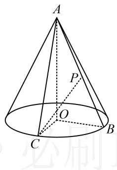

<!-- question-source:start -->
3.（2022·浙江期中·★★★）

如图，圆锥 $AO$ 中， $B$ ， $C$ 是圆 $O$ 上的不同两点，若 $\angle OAB = 30^{\circ}$ ，且二面角 $B - AO - C$ 为 $60^{\circ}$ ，动点 $P$ 在线段 $AB$ 上，则 $CP$ 与平面 $AOB$ 所成角的正切值的最大值为（）A.2 B. $\sqrt{3}$ C. $\sqrt{2}$ D.1

类型Ⅱ：压轴综合多选题
<!-- question-source:end -->

![[Q00050886A1]]
