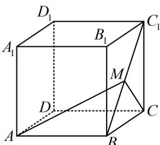

<!-- question-source:start -->
4. (2023·广东六校联考·★★★☆)(多选)

如图, 正方体 $ABCD-A_{1}B_{1}C_{1}D_{1}$ 的棱长为 2 , 若点 $M$ 在线段 $BC_{1}$ 上运动, 则下列结论正确的是 ( ) A. 直线 $A_{1}M$ 可能与平面 $ACD_{1}$ 相交 B. 三棱锥 $A-MCD$ 与三棱锥 $D_{1}-MCD$ 的体积之和为 $\frac{4}{3}$ C. $\triangle AMC$ 的周长的最小值为 $8+4\sqrt{2}$ D. 当点 $M$ 是 $BC_{1}$ 的中点时, $CM$ 与平面 $AD_{1}C_{1}$ 所成角最大

<!-- question-source:end -->

![[Q00050887A1]]
