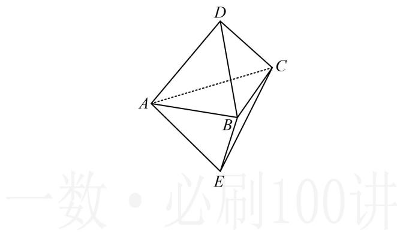

<!-- question-source:start -->
将两个各棱长均为1的正三棱锥 $D - ABC$ 和 $E - ABC$ 的底面重合, 得到如图所示的六面体, 则 ( )  
A. 该几何体的表面积为 $\frac{3\sqrt{3}}{2}$ B. 该几何体的体积为 $\frac{\sqrt{3}}{6}$ C. 过该多面体任意三个顶点的截面中存在两个平面互相垂直  
D. 直线 $AD //$ 平面 $BCE$

<!-- question-source:end -->

![[Q00050888A1]]
