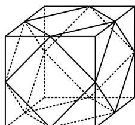

<!-- question-source:start -->
## 6.（2024·新疆乌鲁木齐一模·★★★☆）（多选）

某广场设置了一些石凳供大家休息，这些石凳是由棱长为 $40\mathrm{cm}$ 的正方体截去八个一样的四面体得到的，则（）  
A. 该几何体的顶点数为12  
B. 该几何体的棱数为24  
C. 该几何体的表面积为 $(4800 + 800\sqrt{3})\mathrm{cm}^2$ D. 该几何体外接球的表面积是原正方体内切球、外接球表面积的等差中项

<!-- question-source:end -->

![[Q00050889A1]]
